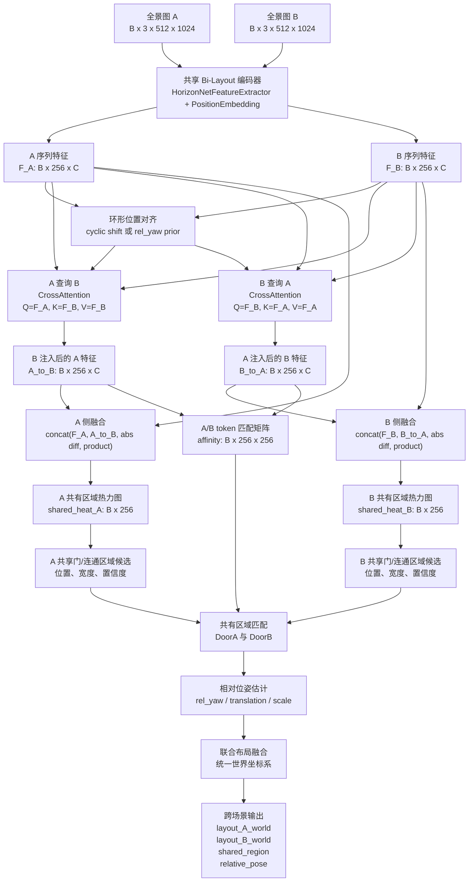
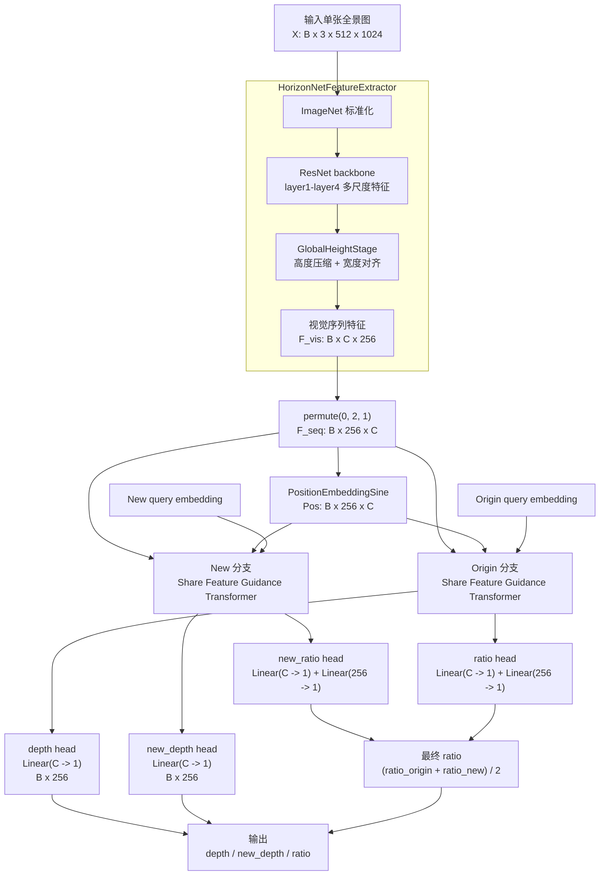

# 保存确认版：Bi-Layout 跨场景 Cross Attention 网络图

这份文件是重新保存后的版本。第一部分就是我们要加的核心：**用双向 Cross Attention 在两张全景图之间寻找共有区域**。

当前 Bi-Layout 单图编码器会把一张全景图编码成一条环形序列：

```text
F_A: B x 256 x C
F_B: B x 256 x C
```

跨场景估计的第一版可以这样做：

```text
A_to_B = CrossAttention(query=F_A, key=F_B, value=F_B)
B_to_A = CrossAttention(query=F_B, key=F_A, value=F_A)

G_A = concat(F_A, A_to_B, abs(F_A - A_to_B), F_A * A_to_B)
G_B = concat(F_B, B_to_A, abs(F_B - B_to_A), F_B * B_to_A)

shared_heat_A = SharedRegionHead(G_A)      # B x 256
shared_heat_B = SharedRegionHead(G_B)      # B x 256
affinity      = MatchHead(A_to_B, B_to_A)  # B x 256 x 256
```

## 1. 双全景 Cross Attention 共有区域模块



## 2. 为什么要加环形位置对齐

全景图是 360 度环形序列。两张相邻房间图里的同一扇门，不一定出现在同一个经度 token 上。

例子：

```text
A 图共享门: token 30
B 图共享门: token 180
```

所以 cross attention 前最好加一个粗对齐步骤：

```text
cyclic shift:
  对 F_B 做多个水平环形位移，再与 F_A 匹配。

rel_yaw prior:
  先预测 B 相对 A 的水平旋转，再把特征对齐。

attention only:
  不做显式对齐，让 attention 自己学；实现最简单，但更吃数据。
```

第一版建议：先做 **cyclic shift + attention only**，后面再加 `rel_yaw` 监督。

## 3. 新增输出变量

```text
shared_heat_A:
  A 中每个经度 token 是否属于共有区域。

shared_heat_B:
  B 中每个经度 token 是否属于共有区域。

affinity:
  A/B token 对应关系矩阵，形状为 B x 256 x 256。

door_A:
  A 中共享门或连通区域的位置、宽度、置信度。

door_B:
  B 中共享门或连通区域的位置、宽度、置信度。

match_score:
  A/B 候选共有区域的匹配概率。

rel_yaw:
  B 相对 A 的水平旋转。

rel_translation:
  B 在 A 坐标系下的平移。

rel_scale:
  B 相对 A 的尺度修正。
```

最终联合输出：

```text
joint_layout = layout_A + transform(layout_B, relative_pose)
```

## 4. 当前 Bi-Layout 单图网络

这是现有 `models/bi_layout.py` 的单图主网络。



## 5. 代码对应关系

- 当前主网络：`models/bi_layout.py`
- 当前特征提取器：`models/modules/horizon_net_feature_extractor.py`
- 当前 Feature Guidance Transformer：`models/modules/share_feature_guidance_module.py`
- 注意力基础模块：`models/modules/transformer_modules.py`
- 现有双全景后处理工具：`tools/join_room_layouts.py`
- 当前联合布局说明：`双全景联合布局.md`
