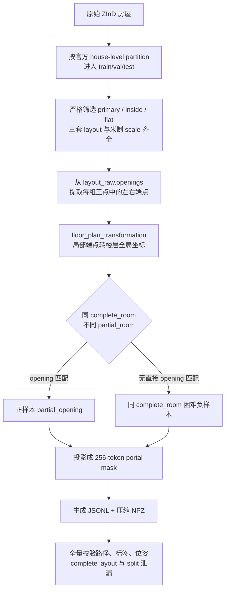

> 修改记录：2026-07-17 11:48 CST - 记录 ZInD-BiPair-v1 的命名、筛选规则、处理代码、标签契约、全量规模和验证结果。
> 修改记录：2026-07-17 13:43 CST - 补充唯一 panorama 开口召回评估、双分支语义和正式 test 基线。

# ZInD-BiPair-v1 数据集说明

## 命名与位置

数据集命名为 **ZInD-BiPair-v1**：

- `ZInD`：原始数据来源。
- `BiPair`：面向 Bi-Layout 的双全景 pair dataset。
- `v1`：第一版只研究同一 `complete_room` 内通过 `opening` 连接的不同 `partial_room`。

完整数据已生成在：

```text
/home/feixia/pythonProject/AAAsrk/zind/ZInD-BiPair-v1/
├── dataset_info.json
├── README.md
├── manifests/
│   ├── train_pairs.jsonl
│   ├── val_pairs.jsonl
│   └── test_pairs.jsonl
├── labels/
│   ├── train/*.npz
│   ├── val/*.npz
│   └── test/*.npz
└── statistics/
    ├── train_stats.json
    ├── val_stats.json
    ├── test_stats.json
    └── invalid_pairs.jsonl
```

图片没有复制，manifest 中的路径仍指向同目录的原始 `data/`，因此派生数据本身只有约 205 MB。

## v1 样本定义

```text
same house
+ same floor
+ same complete_room
+ different partial_room
+ different primary panorama
+ layout_raw.openings 在楼层全局坐标中匹配
```

每个视图还必须满足：

- `is_primary=true`
- `is_inside=true`
- `is_ceiling_flat=true`
- 同时存在 `layout_raw`、`layout_visible`、`layout_complete`
- 存在 `floor_plan_transformation`
- 楼层存在 `scale_meters_per_coordinate`
- 原始全景图片存在

## 处理流程



Opening 匹配同时要求：

| 指标 | 阈值 |
| --- | ---: |
| 中点距离 | `≤ 0.20 m` |
| 无向方向差 | `≤ 10°` |
| 长度相对误差 | `≤ 20%` |
| 正反端点最小平均误差 | `≤ 0.25 m` |

负样本只从同一 `complete_room` 内没有直接 opening 连接的 partial-room pair 中选择，不使用过于简单的跨房屋随机负样本。

## 每个 NPZ 的训练标签

| 标签 | 形状 | 来源/用途 |
| --- | --- | --- |
| `depth_enclosed_A/B` | `[256]` | `layout_raw`，Bi-Layout enclosed 分支 |
| `depth_extended_A/B` | `[256]` | `layout_visible`，extended 分支 |
| `extension_depth_A/B` | `[256]` | `max(0, visible - raw)` 辅助监督 |
| `ratio_A/B` | `[1]` | `(ceiling_height-camera_height)/camera_height` |
| `corners_enclosed/extended_A/B` | `[N,2]` | 两套 layout 投影后的 UV 角点 |
| `opening_mask_all_A/B` | `[256]` | 当前视图所有 raw openings |
| `portal_mask_A/B` | `[256]` | 当前 pair 的共享 opening；负样本全零 |
| `portal_center/width_A/B` | `[1]` | 环形 token 中心和宽度 |
| `affinity_gt` | `[256,256]` | 两侧共享 portal mask 的外积 |
| `T_B_to_A` | `[3,3]` | B 局部坐标到 A 局部坐标的 similarity transform |
| `relative_yaw_gt` | `[1]` | 相对水平旋转 |
| `translation_gt` | `[2]` | A 局部坐标中的相对平移 |
| `translation_meters_gt` | `[2]` | 通过楼层 scale 换算后的米制平移 |
| `relative_scale_gt` | `[1]` | B/A 相对尺度 |
| `joint_layout_global` | `[N,2]` | `layout_complete` 的楼层全局 polygon |
| `shared_portal_global` | `[2,2]` | 共享 opening 全局端点；负样本为空 |

## 全量规模

| Split | 正样本 | 困难负样本 | 总数 | 有 pair 的房屋 |
| --- | ---: | ---: | ---: | ---: |
| train | 4612 | 4612 | 9224 | 1101 |
| val | 571 | 571 | 1142 | 133 |
| test | 495 | 495 | 990 | 127 |
| 合计 | 5678 | 5678 | 11356 | 1361 |

训练集共享 opening 的端点平均误差约 `0.0599 m`，三套 split 的 `layout_complete` A/B 重合率均约为 `1.0`。

## 开口召回评估

单图 Opening Head 的监督与评估必须使用 `opening_mask_all_A/B`。`portal_mask_A/B` 只表示当前 pair 的共享 opening；负 pair 中虽然它全零，但两张单图仍各自存在真实开口。

评估按 `image_path` 去重后，val 有 897 张、test 有 787 张唯一 panorama。当前 ZInD 权重的语义是 `new_depth=raw/enclosed`、`depth=visible/extended`，不能反向解释。

| 深度来源 | Split | val 固定阈值 | Token Precision | Token Recall | F1 | 区间 Recall@IoU0.3 |
| --- | --- | ---: | ---: | ---: | ---: | ---: |
| GT depth | test | 0.12 | 93.98% | 88.32% | 91.06% | 88.34% |
| Bi-Layout checkpoint depth | test | 0.12 | 76.97% | 78.92% | 77.93% | 80.89% |

这说明数据标签和 `visible-raw` 几何线索足够用于第一阶段训练。当前约 9.4 个百分点的 token recall 差距主要来自预测深度误差；下一步应冻结 Bi-Layout，按唯一 panorama 训练 Opening Head，再考虑微调双深度分支。

## 代码与命令

- 构造逻辑：`dataset/zind_bipair_builder.py`
- PyTorch Dataset：`dataset/zind_bipair_dataset.py`
- 生成入口：`tools/build_zind_bipair_v1.py`
- 全量验证：`tools/validate_zind_bipair_v1.py`
- 开口召回评估：`tools/evaluate_zind_opening_recall.py`
- 环形开口指标：`evaluation/opening_recall.py`
- 单元测试：`tests/test_zind_bipair_builder.py`

重新生成：

```bash
conda run -n bi_layout python tools/build_zind_bipair_v1.py \
  --zind_root /home/feixia/pythonProject/AAAsrk/zind/data \
  --partition /home/feixia/pythonProject/AAAsrk/zind/zind_partition.json \
  --output_dir /home/feixia/pythonProject/AAAsrk/zind/ZInD-BiPair-v1 \
  --overwrite
```

全量验证：

```bash
conda run -n bi_layout python tools/validate_zind_bipair_v1.py \
  /home/feixia/pythonProject/AAAsrk/zind/ZInD-BiPair-v1
```

加载训练 batch：

```python
from dataset.zind_bipair_dataset import build_zind_bipair_dataloader

loader = build_zind_bipair_dataloader(
    "/home/feixia/pythonProject/AAAsrk/zind/ZInD-BiPair-v1/manifests/train_pairs.jsonl",
    batch_size=4,
    shuffle=True,
)
batch = next(iter(loader))
```

全量验证结果为 `valid=true`，11,356 个缓存全部通过，train/val/test 房屋泄漏数为 0。当前完成的是训练数据前置条件，还没有开始训练 matcher 或 pose estimator。
