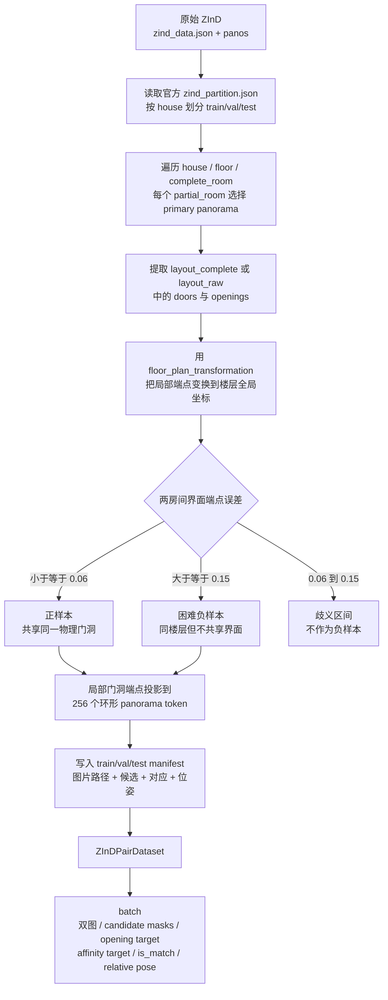

> 修改记录：2026-07-16 16:45 CST - 建立 ZInD 跨场景共享开口匹配数据格式、转换命令与批数据契约。
> 修改记录：2026-07-16 16:56 CST - 新增数据处理流程图与真实 A/B 样本标签拆解。

# ZInD 匹配数据格式

## 目的

原始 ZInD 以“房屋 → 楼层 → 完整房间 → 局部房间 → 全景”的层级保存，适合单张全景布局训练，但不能直接监督双全景匹配。匹配器需要把同一物理门洞两侧的全景组成正样本，同时提供开口位置、对应关系和相对位姿。

本项目不复制 28 GB 全景图，而是保留原始图片，在 `src/dataset/ZInD_matching/` 生成三个 manifest：

```text
src/dataset/ZInD_matching/
├── train.json
├── val.json
├── test.json
└── summary.json
```

`src/dataset/` 已被 Git 忽略，生成的数据不会混入代码提交。

## 处理流程图



关键点是先在楼层全局坐标中判断两条门洞线段是否属于同一物理界面，再回到各自全景局部坐标生成 token 标签；不能直接按相机距离配对。

## 样本构造规则

- 严格沿用官方 `zind_partition.json` 的 house-level train/val/test 划分，避免同一房屋跨集合泄漏。
- 每个局部房间优先选择 primary panorama。
- 将两个完整房间中全局端点平均误差不超过 `0.06` 的重复 door/opening 标注视为同一共享界面，生成正样本。
- 从同一楼层、两侧都含 door/opening、但最小端点误差至少为 `0.15` 的房间中选困难负样本。
- 默认正负比例接近 1:1；没有安全负样本的楼层不会强行补齐。
- 每条门洞线段投影到与 Bi-Layout `patch_num=256` 一致的环形 token 区间，跨全景接缝的区间可表示为 `[start > end]`。

## Manifest 关键字段

每条记录包含：

| 字段 | 含义 |
| --- | --- |
| `image_a`, `image_b` | 相对 `dataRoot` 的原始 ZInD 全景路径 |
| `scene_id`, `floor_id` | 房屋与楼层，便于分组评估 |
| `candidates_a`, `candidates_b` | 两侧全部 door/opening 候选及其局部/全局端点、256-token 区间 |
| `supervision.is_match` | 是否共享同一物理门洞/开口 |
| `target_candidate_a/b` | 正样本两侧真值候选索引；负样本为 `-1` |
| `relative_transform_b_to_a` | 从 B 局部平面坐标变换到 A 局部平面坐标的 3×3 similarity matrix |
| `relative_yaw_radians` | 从真值变换提取的相对 yaw |
| `pose_valid` | 仅正样本为 `true`，用于屏蔽负样本的位姿损失 |

Manifest 只保存紧凑 token 区间，不保存每条样本的 256×256 密集矩阵。密集监督在 DataLoader 中按需展开。

## 真实 A/B 数据点与标签示例

以下记录来自全量 `train.json`，不是手工构造样本：

```text
pair_id: 0919_floor_01_pano_41_pano_29_3
house/floor: 0919 / floor_01
A: kitchen, complete_room_01, pano_41
B: bedroom, complete_room_06, pano_29
```

这里的 A 是一张全景数据点；door/opening 不是单个点，而是由两个端点组成的线段。A 一共有 5 个门候选：

| A 候选索引 | 类型 | token 区间 | 是否为共享门真值 |
| ---: | --- | --- | --- |
| 0 | door | `[247, 1]`，跨接缝 | 否 |
| 1 | door | `[143, 162]` | 否 |
| 2 | door | `[107, 117]` | 是 |
| 3 | door | `[155, 160]` | 否 |
| 4 | door | `[135, 143]` | 否 |

A 真值门候选 2 的原始局部端点是 `[[0.5024, 1.9959], [1.0023, 1.8260]]`，变换到楼层全局坐标后是 `[[0.0112, -1.8036], [0.2246, -1.8036]]`。它对应 B 的门候选 1：

| B 真值候选 | token 区间 | 全局端点 |
| ---: | --- | --- |
| 1 | `[97, 109]` | `[[0.0041, -1.7669], [0.2241, -1.7669]]` |

两侧门洞端点平均误差为 `0.0370`，小于正样本阈值 `0.06`，因此生成的标签为：

| 标签 | 本样本的值 | 训练含义 |
| --- | --- | --- |
| `is_match` | `true` | A/B 共享同一物理门洞 |
| `target_candidate_pair` | `[2, 1]` | A 候选 2 对应 B 候选 1 |
| `opening_target_A` | A 的 5 个候选区间并集 | 监督 A 上所有已标注 door/opening，不只监督共享门 |
| `opening_target_B` | B 的 4 个候选区间并集 | 监督 B 上所有已标注 door/opening |
| `affinity_target_AB` | A `[107,117]` 与 B `[97,109]` 的外积 | 143 个正 token 对，其余为 0 |
| `relative_yaw_radians` | `2.8274`，约 `162.0°` | 环形水平旋转监督 |
| `relative_transform_B_to_A` | 3×3 similarity matrix | B 局部布局变换到 A 局部布局 |
| `pose_valid` | `true` | 该样本参与位姿损失 |

负样本仍保留两侧各自的 `opening_target`，但 `is_match=false`、`target_candidate_pair=[-1,-1]`、`affinity_target_AB` 全零且 `pose_valid=false`。

## DataLoader 输出

```python
from dataset.panorama_pair_dataset import build_pair_dataloader

loader = build_pair_dataloader(
    "src/dataset/ZInD_matching/train.json",
    batch_size=4,
    shuffle=True,
)
batch = next(iter(loader))
```

训练相关 batch 键：

| 键 | 形状 | 用途 |
| --- | --- | --- |
| `image_A`, `image_B` | `[B, 3, H, W]` | 双全景输入 |
| `candidate_masks_A/B` | `[B, Kmax, 256]` | 开口候选区间，K 维已 padding |
| `candidate_valid_A/B` | `[B, Kmax]` | 屏蔽 padding 候选 |
| `opening_target_A/B` | `[B, 256]` | Opening Signal Head 的门洞/开口监督 |
| `affinity_target_AB` | `[B, 256, 256]` | 正样本共享界面的 token 对应监督；负样本全零 |
| `is_match` | `[B]` | 正负样本标签 |
| `target_candidate_pair` | `[B, 2]` | 候选级共享界面索引 |
| `relative_transform_B_to_A` | `[B, 3, 3]` | 相对位姿真值 |
| `relative_yaw_radians` | `[B]` | 环形 shift/yaw 监督 |
| `pose_valid` | `[B]` | 位姿损失有效性掩码 |

如数据移动到另一台机器，可在 `build_pair_dataloader(..., data_root="/new/zind/data")` 覆盖 manifest 中的 `dataRoot`。

## 转换命令

完整转换：

```bash
conda run -n bi_layout python tools/build_zind_matching_dataset.py \
  --zind_root /home/feixia/pythonProject/AAAsrk/zind/data \
  --partition /home/feixia/pythonProject/AAAsrk/zind/zind_partition.json \
  --output_dir src/dataset/ZInD_matching
```

小样本格式检查：

```bash
conda run -n bi_layout python tools/build_zind_matching_dataset.py \
  --max_houses_per_split 3 \
  --output_dir src/output/zind_matching_dataset_smoke
```

## 2026-07-16 全量转换结果

| Split | 房屋 | 正样本 | 负样本 | 总数 |
| --- | ---: | ---: | ---: | ---: |
| train | 1260 | 14741 | 14584 | 29325 |
| val | 157 | 1827 | 1803 | 3630 |
| test | 158 | 1856 | 1833 | 3689 |
| 合计 | 1575 | 18424 | 18220 | 36644 |

所有 1575 套房屋转换成功，缺失标注为 0，缺失图片为 0。以上是训练数据规模，不是匹配模型准确率。
