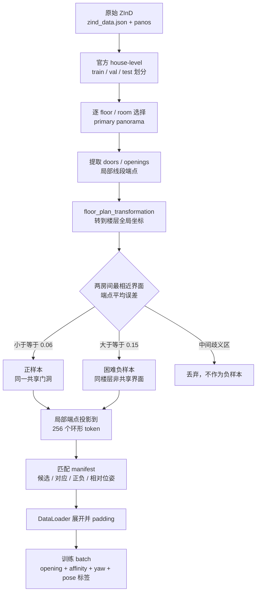

> 修改记录：2026-07-16 15:21 CST - 汇总 100 张 ZInD 双头评估、相邻双全景 GPU 流程和回归测试结果。
> 修改记录：2026-07-16 16:01 CST - 新增 3 套房屋 8 对真实共享门洞全景的候选、匹配、位姿与闭环评估。
> 修改记录：2026-07-16 16:03 CST - 更新 24 项回归结果并明确双全景诊断指标的汇报边界。
> 修改记录：2026-07-16 16:06 CST - 清理联合布局汇报图的墙编号，并更新 25 项完整回归结果。
> 修改记录：2026-07-16 16:12 CST - 记录双分支配置修复、置信度语义收紧和未训练模块隔离验证。
> 修改记录：2026-07-16 16:45 CST - 新增完整 ZInD 匹配训练数据转换、数据规模和批格式验证结果。
> 修改记录：2026-07-16 16:56 CST - 补充 ZInD 数据处理流程图以及真实 A/B 数据点和标签示例。
> 修改记录：2026-07-17 11:48 CST - 完成严格 partial-opening 数据集 ZInD-BiPair-v1 的代码、全量生成和逐缓存验证。
> 修改记录：2026-07-17 13:43 CST - 完成 ZInD-BiPair-v1 开口召回全量评估，修正双深度分支接反并落地环形候选阈值。
> 修改记录：2026-07-20 14:57 CST - 完成 ZInD-BiPair-v1 Opening Head 全量训练与独立 test 评估，记录 checkpoint、阈值和召回提升。
> 修改记录：2026-07-20 18:33 CST - 完成 Cross-Scene Matcher 正式训练、正式权重 M0-M9 全流程和相邻完整房间能力边界评估。

# Bi-Layout 跨场景项目进度实验结果

## 一、当前结论

目前已经有五部分可以用于阶段汇报：

1. 已训练的 Bi-Layout 基础模型可以在 ZInD 测试样本上稳定输出双头布局，并得到定量 IoU。
2. 已训练的 Opening Head 和 Cross-Scene Matcher 正式权重已接入相邻双全景 M0-M9，从图像输入到联合布局输出 10/10 PASS。
3. 已建立真实共享门洞双全景评估集，可以定量定位开口候选、匹配排序和相对位姿误差。
4. 已在 7,284 张 train 全景上训练单图 Opening Head，并在 787 张独立 test 全景上完成固定 val 阈值评估。
5. 已在 9,094 个 train view-pair group 上完成 12 轮 Cross-Scene Matcher 正式训练，并在 1,134 个 val group 上分别做真值候选隔离评估与预测开口端到端评估。

本轮结果用于验证阶段进度，不等同于完整测试集上的最终论文结果。100 张样本取自测试列表前 100 个有效样本，并非随机或分层抽样。

## 二、100 张 ZInD 双头定量评估

- 模型：`checkpoints/Bi_Layout_Net/zind_all/zind_all_best_model.pkl`
- 设备：NVIDIA GeForce RTX 4060 Ti 16GB，`cuda:0`
- 样本：100 张有效全景图，25 个 batch，`batch_size=4`
- 模型参数量：102,326,614
- 推理与评估阶段耗时：约 58 秒

| 输出及评估目标 | Full 2D IoU | Full 3D IoU | 说明 |
| --- | ---: | ---: | --- |
| Original head 对原始标签 | 87.84% | 85.40% | 基础头结果 |
| New head 对配对的新标签 | 91.44% | 88.91% | 评估目标与上一行不同，不能直接视为同一标签上的提升 |
| Oracle 对原始标签 | 89.11% | 86.64% | 每张图在两个头中选择更接近原始标签的输出 |

Oracle 在 100 张图中选择 Original head 65 次、New head 35 次。这说明两个输出在原始标签目标上存在互补性，但真正的自动选择效果仍需训练几何置信度选择头后单独评估。

完整指标位于：`checkpoints/Bi_Layout_Net/zind_all/results/test_best/result.json`。

## 三、正式权重的相邻双全景 M0-M9 工程流程

正式冒烟测试已同时加载 Bi-Layout 和 `ZInD-BiPair-v1` Matcher 最优权重，Matcher checkpoint 内嵌已训练 Opening Head，不再使用随机 Cross Attention。

- 场景：ZInD `0000/floor_01`
- 全景 A/B：`bathroom/pano_32` 与 `laundry/pano_31`
- 设备：CPU
- Bi-Layout：`checkpoints/Bi_Layout_Net/zind_all/zind_all_best_model.pkl`
- Matcher：`checkpoints/Cross_Scene_Matcher/zind_bipair_v1/best.pt`
- 开口候选来源：`learned_opening_probability`，checkpoint 阈值 0.375

| 检查项 | 本轮结果 |
| --- | --- |
| M0-M9 模块数据格式检查 | 10/10 PASS |
| Bi-Layout / Opening Head / Matcher 权重 | 全部成功加载 |
| 两个布局 | 2/2 有效 Manhattan 多边形 |
| 候选数 | 3 |
| 联合布局文件 | 成功生成 |

本次完成的是“真实图像 → Bi-Layout 特征/深度 → Opening 候选 → Cross Attention 匹配 → 几何候选 → 联合布局”的完整调用链。B 侧本例阈值后无区间，因此使用了开口概率峰值最小宽度回退；这是显式记录的 learned-opening 防护路径，不是重新切回深度启发式候选。

正式权重流程产物：

- `src/output/cross_scene_flow_zind_bipair_v1/module_format_report.json`
- `src/output/cross_scene_flow_zind_bipair_v1/flow_candidates.json`
- `src/output/cross_scene_flow_zind_bipair_v1/flow_best_joint_layout.json`
- `src/output/cross_scene_flow_zind_bipair_v1/pair_manifest.json`

## 四、独立相邻完整房间评估

为了检查从 `ZInD-BiPair-v1` “同一 complete room 内不同 partial room”训练分布到“不同 complete room 共享门洞”的迁移边界，另外从 4 套房屋中选取 8 对真实相邻全景，并加载正式 Matcher checkpoint 运行。

| 指标 | 结果 |
| --- | ---: |
| 工程全流程成功 | 8/8 |
| Cross Attention 候选 Top-1 | 0% |
| Cross Attention 候选 Top-8 | 12.5% |
| 概率峰值最小宽度回退 | 5/8 对 |
| A 侧真值开口墙召回 | 50% |
| B 侧真值开口墙召回 | 25% |

结论要分两层看：软件链路已经稳定跑通，但匹配能力还没有跨过场景分布差异。当前 Matcher 的直接训练监督来自同一 complete room 的 partial-view pair，对真正的相邻完整房间未形成可靠 Top-1 泛化；5/8 的峰值回退和 A/B 墙召回 50%/25% 也说明此时开口候选迁移是首个能力瓶颈。这组 8 对数字是能力边界诊断，不取代 1,134 个 val group 的训练域评估。

完整结果与逐对可视化位于：

- `src/output/zind_cross_scene_eval_zind_bipair_v1/summary.json`
- `src/output/zind_cross_scene_eval_zind_bipair_v1/records.json`
- `src/output/zind_cross_scene_eval_zind_bipair_v1/pair_manifest.json`
- `src/output/zind_cross_scene_eval_zind_bipair_v1/visualizations/`

## 五、回归测试

完整单元测试结果：`79/79 PASS`；除原有的双深度分支映射、环形连通域、跨 seam 区间 IoU、manifest 去重、同步 roll/flip 增强、阈值选择、checkpoint 保存和断点续训外，现已覆盖 ZInD-BiPair 适配合同、多 portal view-pair 合并、candidate dustbin、Matcher 反向传播以及 Opening/Matcher checkpoint 契约校验。

本轮同时修复了 `main.py --for_test_index N` 对 `ZindNewDataset` 不生效的问题，并添加了回归测试。修复后可以快速抽取前 N 个有效样本做阶段评估，不必每次运行完整测试集。

## 六、汇报边界

当前可以汇报：

- 已训练 Bi-Layout 基础模型在 100 张 ZInD 样本上的定量布局结果。
- 正式 Bi-Layout + Opening Head + Matcher 权重已经在双全景 M0-M9 全流程跑通，所有模块格式检查通过。
- 候选生成、几何过滤、NMS、联合布局和异常回退机制均有实际输出。
- 已建立基于 ZInD 标注门洞与全景位姿的真实相邻房间评估集，并可分阶段评估候选召回、共享墙 Top-K、相对位姿和正反闭环。
- Opening Head 已使用独立 train/val/test 划分完成训练，test token Recall 为 88.08%，区间 Recall@IoU0.3 为 86.23%。
- Cross-Scene Matcher 已完成 12 轮正式训练，可以汇报 val 上的候选召回、匹配 Top-K、dustbin 负样本拒绝和端到端指标。

当前还不能作为最终模型精度或有效性结论：

- 8 对跨 complete-room 样本只能作为能力边界诊断；当前 Top-1 为 0%，不能宣称已具备可靠的真实相邻房间泛化能力。
- 1,134 个 val group 与 8 对相邻完整房间的数据分布不同，两者必须分开报告。
- 几何置信度选择头相对 Oracle 的逼近程度。
- 当前学习的 portal token 环形位移不是 camera yaw，不能将 token shift 误差当成相机位姿误差。

Opening Head 和 Opening-guided Cross Attention Matcher 均已训练；仍未训练的学习模块是 Geometry Selector。下一阶段应将相邻 complete-room 正样本与更强困难负样本加入匹配训练，先解决跨房间候选召回和 Top-1 泛化，再训练 Geometry Selector 选择最终联合布局。如需直接预测相机位姿，还应单独定义并训练 camera-yaw/pose head，不应复用 portal token shift 名义。

## 七、本轮代码整改

- `use_same_head=True, output_number=2` 已改为复用原始 depth/ratio head，不再访问未创建的第二套 head。
- `share_TF=False` 现在会创建并调用独立 Transformer；`two_conv_out=True` 现在会创建并调用独立高度压缩模块。
- README 已明确：顶层 `dataset/` 是加载代码，`src/dataset/` 是由配置指定且不纳入 Git 的数据目录。
- 开口和墙对候选输出新增 `confidenceType` 与 `isCalibratedProbability=false`，避免把启发式 softmax 分数解释成校准概率。
- 没有 matcher/selector checkpoint 时，随机初始化模块只参加 M3-M8 接口检查，不再影响 M7/M9 最终候选排序；提供训练 checkpoint 后才启用相应神经分数。
- 现有 ZInD Bi-Layout checkpoint 已在 CPU 上完成 M0-M9 真实端到端冒烟验证，默认模型结构仍兼容旧权重。

评估脚本在未提供 `--matcher_checkpoint` 时只统计几何变体，不输出随机 Cross Attention 准确率；提供正式 Matcher checkpoint 后，才使能神经匹配排序与准确率统计。Geometry Selector 仍保持 checkpoint 门控，未训练时不得伪装为最终模型分数。

## 八、ZInD 匹配训练数据转换

原始 ZInD 已按官方 house-level train/val/test 分区转换为跨场景匹配 manifest。图片保持原位，没有复制 28 GB 图像；manifest 保存全景对、全部门洞/开口 token 区间、共享界面对应关系、正负标签和 B→A 相对位姿。

| Split | 房屋 | 正样本 | 困难负样本 | 总数 |
| --- | ---: | ---: | ---: | ---: |
| train | 1260 | 14741 | 14584 | 29325 |
| val | 157 | 1827 | 1803 | 3630 |
| test | 158 | 1856 | 1833 | 3689 |
| 合计 | 1575 | 18424 | 18220 | 36644 |

- 缺失标注：0
- 缺失图片：0
- token 数：256，与 Bi-Layout `patch_num` 对齐
- 正样本：两房间重复标注的同一 door/opening，全局端点误差不超过 0.06
- 困难负样本：同楼层且两侧都有界面候选，但最小端点误差至少为 0.15
- 全量输出：`src/dataset/ZInD_matching/`
- 格式说明：`ZInD匹配数据格式.md`

正负混合 batch 已验证可直接输出 `[B,3,H,W]` 双图、`[B,K,256]` 候选 mask、`[B,256]` 开口 target、`[B,256,256]` affinity target、`[B,3,3]` 相对位姿和对应有效性掩码。这套 `ZInD_matching` 跨 complete-room 数据契约已为下一阶段域适配训练准备好，但本轮正式 Matcher 训练使用的是第九节 `ZInD-BiPair-v1` 的 feature dataset，不应混为同一数据域。

### 8.1 数据处理流程图



### 8.2 真实 A 数据点和标签

示例来自全量训练集 `0919_floor_01_pano_41_pano_29_3`：

| 项目 | A | B |
| --- | --- | --- |
| 场景 | `0919/floor_01` | `0919/floor_01` |
| 房间 | `complete_room_01`，kitchen | `complete_room_06`，bedroom |
| 全景 | `pano_41` | `pano_29` |
| 界面候选数 | 5 | 4 |
| 共享门真值候选 | 2 | 1 |
| 共享门 token 区间 | `[107,117]` | `[97,109]` |

A 真值门洞不是单个点，而是两端点线段：局部坐标为 `[[0.5024,1.9959],[1.0023,1.8260]]`，楼层全局坐标为 `[[0.0112,-1.8036],[0.2246,-1.8036]]`。B 对应门洞的全局坐标为 `[[0.0041,-1.7669],[0.2241,-1.7669]]`，端点平均误差 `0.0370 < 0.06`。

本样本最终标签：`is_match=true`、`target_candidate_pair=[2,1]`、相对 yaw `2.8274 rad ≈ 162.0°`、`pose_valid=true`。`opening_target_A/B` 标记两侧全部门洞候选；`affinity_target_AB` 只把 A 真值区间 `[107,117]` 与 B 真值区间 `[97,109]` 的 143 个 token 对标为 1。

## 九、ZInD-BiPair-v1 数据集

按照“同一 complete room、不同 partial room、共享 opening”的第一阶段要求，新建的数据集命名为 `ZInD-BiPair-v1`，并已生成在 `/home/feixia/pythonProject/AAAsrk/zind/ZInD-BiPair-v1/`。它和第八节的跨 complete-room 诊断清单用途不同：本数据集把 `layout_raw`、`layout_visible`、`layout_complete`、共享 opening、相对位姿和米制平移统一写入训练缓存。

| Split | 正样本 | 困难负样本 | 总数 |
| --- | ---: | ---: | ---: |
| train | 4612 | 4612 | 9224 |
| val | 571 | 571 | 1142 |
| test | 495 | 495 | 990 |
| 合计 | 5678 | 5678 | 11356 |

- 数据集体积：约 205 MB，不复制原始全景图。
- 标签缓存：11,356 个 NPZ，与 manifest 行数完全一致。
- 全量逐缓存验证：`valid=true`。
- train/val/test 房屋级泄漏：0。
- 训练集 opening 端点平均误差：约 0.0599 m。
- `layout_complete` A/B 重合率：约 1.0。
- 详细说明：`ZInD-BiPair-v1数据集说明.md`。

## 十、ZInD-BiPair-v1 开口召回率

评估按 `view.image_path` 去重，单图真值固定使用 `opening_mask_all`，不使用 pair-specific 的 `portal_mask`。val 共 897 张唯一全景图，test 共 787 张；指标支持跨越 token `255 -> 0` 的环形开口。

本轮首先发现并修复了一个关键接线错误：`zind_all` 权重训练时第一分支 `depth` 对应 `layout_visible/extended`，第二分支 `new_depth` 对应 `layout_raw/enclosed`。旧跨场景代码把两者反向送入 `relu(D_ext-D_enc)`，会直接清除大部分正开口响应。现统一通过 `resolve_enclosed_extended_depth` 显式映射。

| 深度来源与设置 | Split | 阈值 | AP | Precision | Recall | F1 | 区间 Recall@IoU0.3 |
| --- | --- | ---: | ---: | ---: | ---: | ---: | ---: |
| GT depth，旧反向语义 | val | 0.000 | 28.96% | 29.21% | 100.00% | 45.21% | 13.54% |
| GT depth，正确语义 | val | 0.120 | 94.87% | 94.37% | 89.25% | 91.74% | 89.58% |
| GT depth，固定 val 阈值 | test | 0.120 | 93.71% | 93.98% | 88.32% | 91.06% | 88.34% |
| checkpoint 预测 depth，最佳 F1 | val | 0.125 | 83.53% | 88.15% | 70.88% | 78.58% | 78.50% |
| checkpoint 预测 depth，召回优先 | val | 0.120 | 83.53% | 78.41% | 77.75% | 78.08% | - |
| checkpoint 预测 depth，零权重几何先验 | test | 0.120 | 82.15% | 76.97% | 78.92% | 77.93% | 80.89% |
| 训练 Opening Head，最佳 epoch 13 | val | 0.375 | 91.48% | 80.09% | **87.16%** | 83.48% | **87.33%** |
| 训练 Opening Head，固定 val 阈值 | test | 0.375 | **90.62%** | 78.50% | **88.08%** | **83.02%** | **86.23%** |

训练后 test token Recall 从 78.92% 提升到 88.08%，增加 9.17 个百分点；区间 Recall@IoU0.3 从 80.89% 提升到 86.23%，增加 5.34 个百分点；AP 从 82.15% 提升到 90.62%。test 的区间 Recall@IoU0.5 为 74.04%，高于基线的 72.16%。由于运行点按 val 上 `Precision >= 0.80` 时最大召回选取，test Precision 为 78.50%，这是召回优先策略的明确取舍。

已经落地的改进：

1. 修正 `depth/new_depth` 到 `enclosed/extended` 的语义映射，并为相反标签顺序保留显式配置。
2. 新增唯一 panorama 开口召回评估器，val 选阈值、test 只接受固定阈值，避免测试集泄漏。
3. 将候选生成从“无阈值固定 Top-4、每段 9 token”改成阈值 0.12 的环形连通域，保留真实预测宽度，最小宽度 2 token。
4. 旧 8 对跨房间诊断在分支修正后，geometry opening Top-K recall 从 0% 提升到 25%，Top-1 从 0% 提升到 12.5%；该小样本只用于证明接线修复，不作为 BiPair 正式成绩。
5. 冻结 Bi-Layout，对 7,284 张唯一 train panorama 缓存 `[256,512]` FP16 特征和预测双深度，用 `opening_mask_all` 训练约 14.9 万参数的 Opening Head。损失为正样本加权 BCE（`pos_weight=2.5`）加 Tversky，并做同步环形 roll/flip 增强。

单图 Opening Head 训练已完成，并已作为依赖接入第十一节的正式 Matcher 训练与推理。`opening_mask_all` 始终是单图“所有开口”标签，pair-specific `portal_mask` 只监督哪两个候选共享，不会把负 pair 中的真实开口错标为背景。

正式产物：

- 最优权重：`checkpoints/Opening_Head/zind_bipair_v1/best.pt`，约 1.85 MB，最优 epoch 13，阈值 0.375。
- 最后一轮：`checkpoints/Opening_Head/zind_bipair_v1/last.pt`。
- 特征缓存：`checkpoints/Opening_Head/zind_bipair_v1/cache/`，train 约 1.8 GB，val 约 227 MB。
- 每轮指标：`checkpoints/Opening_Head/zind_bipair_v1/metrics.jsonl`。
- 独立 test 报告：`src/output/zind_opening_recall/test_predicted_depth_opening_head.json`。

特征缓存耗时约 343.5 秒，25 epoch 头部训练累计约 145.5 秒。

## 十一、Cross-Scene Matcher 正式训练

### 11.1 训练数据与接口

`ZInD-BiPair-v1` 原始 manifest 是以共享 portal record 为单位的。同一个有向 A/B view pair 可能存在多个共享 portal；如果直接将每个 record 当作独立样本，同一对全景会出现重复甚至矛盾的 dustbin 监督。训练加载器现按有向 view pair 合并多 portal mask 和 affinity：

| Split | 原 portal records | 合并后 view-pair groups | 正/负 groups |
| --- | ---: | ---: | ---: |
| train | 9,224 | 9,094 | 4,482 / 4,612 |
| val | 1,142 | 1,134 | 563 / 571 |

匹配器输入复用 Opening Head 阶段已缓存的 Bi-Layout 预测特征和预测双深度，没有在匹配训练中偷用 GT depth。接口严格分离三类语义：`opening_all` 表示单图所有开口，candidate masks 表示候选区间，`shared_portal`/affinity 只表示该 A/B pair 的共享开口真值。

### 11.2 训练设置

- 设备：CPU，12 epoch，`batch_size=4`，`lr=2e-4`，记录的累计训练+双路 val 时间为 3,814.11 秒（约 63.6 分钟）。
- Opening 运行阈值：0.375，由 Opening checkpoint 固定并写入 Matcher checkpoint。
- guidance 调度：前 4 轮 GT，中间 4 轮 mix，最后 4 轮 predicted。guidance 只影响 Matcher 的候选条件，不把 Opening Head 的预测 logits 替换成真值。
- 损失：candidate assignment + A/B 一致性 + token affinity + portal token shift；本轮的 analytic shared response 权重为 0。
- dustbin：已在 candidate assignment 层使用可学习 dustbin，支持正样本未匹配候选和负 pair 拒绝；token-level attention 矩阵本身仍没有独立 dustbin token。

### 11.3 最优 checkpoint 指标

checkpoint 按“预测 Opening 候选”路径的 `balanced_flow_score` 选择，最优为第 11 轮（checkpoint 内 `completed_epoch=10`，代码从 0 计数）。以下数值直接读取自 `best.pt` 内的 `validation`，而不是第 12 轮 `latest_metrics.json`：

| val 指标 | 预测 Opening 候选（端到端） | GT 候选（teacher-forced 隔离） |
| --- | ---: | ---: |
| Candidate Recall@IoU0.3 | 77.44% | 97.34% |
| 正 pair 接受率 | 54.00% | 59.15% |
| Conditional Candidate Top-1 | 44.27% | 53.65% |
| Conditional Candidate Top-3 | 92.20% | 97.26% |
| End-to-End Candidate Top-1 | 34.28% | 52.22% |
| Negative Rejection | 85.46% | 88.97% |
| Balanced Flow Score | **59.87%** | 70.59% |
| Portal token shift 平均环形误差 | 62.87° | 59.76° |

第 12 轮的 predicted conditional Top-1 是 48.39%，但它的 Negative Rejection 降为 80.56%、Balanced Flow Score 降为 59.02%，因此没有被选为 `best.pt`。不应将第 12 轮的 48.39% 与第 11 轮的 End-to-End Top-1 34.28% 混合成同一 checkpoint 的指标。

Portal token shift 表示共享开口中心在 B/A 的 256-token 环形位移，**不是 camera yaw**。上表的 62.87° 是把 token 环形差换算为角度的表示，不能作为相机旋转误差报告。

正式产物：

- 最优权重：`checkpoints/Cross_Scene_Matcher/zind_bipair_v1/best.pt`。
- 最优轮完整指标：`checkpoints/Cross_Scene_Matcher/zind_bipair_v1/best_metrics.json`。
- 最后一轮：`checkpoints/Cross_Scene_Matcher/zind_bipair_v1/last.pt`。
- 每轮指标：`checkpoints/Cross_Scene_Matcher/zind_bipair_v1/metrics.jsonl`。
- 最新轮汇总：`checkpoints/Cross_Scene_Matcher/zind_bipair_v1/latest_metrics.json`。
- 正式 M0-M9 报告：`src/output/cross_scene_flow_zind_bipair_v1/module_format_report.json`。
- 相邻完整房间报告：`src/output/zind_cross_scene_eval_zind_bipair_v1/summary.json`。

当前 Matcher 已经不是未训练随机头，但 Geometry Selector 仍然未训练。第四节的跨 complete-room 结果说明，下一阶段需要扩充相邻完整房间匹配监督，而不是重复证明当前软件流程能否运行。

## 十二、复现命令

```bash
conda run -n bi_layout python main.py \
  --cfg src/config/zind_all.yaml \
  --mode test \
  --device cuda:0 \
  --for_test_index 100 \
  --bs 4 \
  --save_eval
```

```bash
conda run -n bi_layout python tools/debug_cross_scene_flow.py \
  --device cpu \
  --matcher_checkpoint checkpoints/Cross_Scene_Matcher/zind_bipair_v1/best.pt \
  --output_dir src/output/cross_scene_flow_zind_bipair_v1 \
  --torch_threads 4
```

```bash
conda run -n bi_layout python tools/evaluate_zind_cross_scene_pairs.py \
  --device cpu \
  --matcher_checkpoint checkpoints/Cross_Scene_Matcher/zind_bipair_v1/best.pt \
  --house_count 4 \
  --pairs_per_house 2 \
  --max_pairs 8 \
  --top_k 8 \
  --output_dir src/output/zind_cross_scene_eval_zind_bipair_v1
```

```bash
conda run -n bi_layout python -m unittest discover -s tests -v
```

```bash
conda run -n bi_layout python tools/build_zind_matching_dataset.py \
  --zind_root /home/feixia/pythonProject/AAAsrk/zind/data \
  --partition /home/feixia/pythonProject/AAAsrk/zind/zind_partition.json \
  --output_dir src/dataset/ZInD_matching
```

```bash
conda run -n bi_layout python tools/build_zind_bipair_v1.py \
  --zind_root /home/feixia/pythonProject/AAAsrk/zind/data \
  --partition /home/feixia/pythonProject/AAAsrk/zind/zind_partition.json \
  --output_dir /home/feixia/pythonProject/AAAsrk/zind/ZInD-BiPair-v1 \
  --overwrite
```

```bash
conda run -n bi_layout python tools/validate_zind_bipair_v1.py \
  /home/feixia/pythonProject/AAAsrk/zind/ZInD-BiPair-v1
```

```bash
conda run -n bi_layout python tools/evaluate_zind_opening_recall.py \
  --source predicted-depth \
  --split val \
  --branch_order extended_first \
  --device cuda \
  --output src/output/zind_opening_recall/val_predicted_depth_correct.json
```

固定 val 的召回优先阈值后评估 test：

```bash
conda run -n bi_layout python tools/evaluate_zind_opening_recall.py \
  --source predicted-depth \
  --split test \
  --branch_order extended_first \
  --threshold 0.12 \
  --device cuda \
  --output src/output/zind_opening_recall/test_predicted_depth_correct_t012.json
```

缓存冻结 Bi-Layout 输出并训练 Opening Head：

```bash
conda run -n bi_layout python tools/train_zind_opening_head.py \
  --device cuda \
  --epochs 25 \
  --cache_batch_size 4 \
  --batch_size 64 \
  --workers 4 \
  --output_dir checkpoints/Opening_Head/zind_bipair_v1
```

使用 checkpoint 中保存的 val 阈值评估 test，不在 test 上重新扫描阈值：

```bash
conda run -n bi_layout python tools/evaluate_zind_opening_recall.py \
  --split test \
  --source predicted-depth \
  --opening_checkpoint checkpoints/Opening_Head/zind_bipair_v1/best.pt \
  --device cuda \
  --batch_size 4 \
  --output src/output/zind_opening_recall/test_predicted_depth_opening_head.json
```

复用上述 Opening Head 特征缓存，从头完整训练 12 轮 Matcher：

```bash
conda run -n bi_layout python tools/train_zind_cross_scene_matcher.py \
  --dataset_root /home/feixia/pythonProject/AAAsrk/zind/ZInD-BiPair-v1 \
  --opening_checkpoint checkpoints/Opening_Head/zind_bipair_v1/best.pt \
  --train_cache_dir checkpoints/Opening_Head/zind_bipair_v1/cache/train \
  --val_cache_dir checkpoints/Opening_Head/zind_bipair_v1/cache/val \
  --device cpu \
  --epochs 12 \
  --batch_size 4 \
  --gt_guidance_epochs 4 \
  --mix_guidance_epochs 4 \
  --torch_threads 4 \
  --output_dir checkpoints/Cross_Scene_Matcher/zind_bipair_v1 \
  --overwrite
```

如需从已保存的轮次继续，使用 `--resume checkpoints/Cross_Scene_Matcher/zind_bipair_v1/last.pt` 并不要同时传 `--overwrite`。
