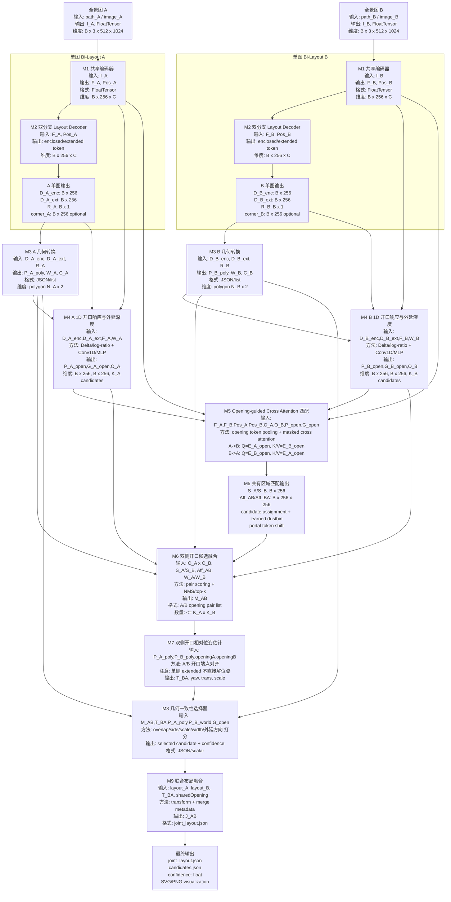
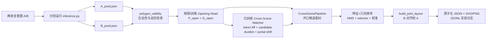

> 修改记录：2026-07-13 16:32 CST - 将跨场景旧流程升级为工程版，补齐成对数据、可训练匹配、几何验证、候选筛选、选择器、日志与统一管线。
> 修改记录：2026-07-17 13:43 CST - 修正 ZInD 权重的双深度分支语义，补充开口召回评估和验证集阈值约定。
> 修改记录：2026-07-20 14:57 CST - 完成 M4 Opening Head 全量训练、checkpoint 接入和独立 test 评估，更新模块状态与后续训练顺序。
> 修改记录：2026-07-20 18:37 CST - 完成 M5 Matcher 全量训练与 checkpoint 接入，统一候选级 dustbin、双向分配和 portal token 环形位移语义，并记录跨 complete-room 域差距。

# 跨场景共享开口融合网络架构 可编辑版

## 0. 目标定义

本方案不是把跨场景限定为“两个房间共享一扇门”，而是定义为：

```text
两张 360 全景图来自相邻可连通空间。
只要二者共享同一个可通行开口/洞口/开放接口，并且 enclosed/extended 分支在该开口附近产生可通行响应或局部外延线索，
就尝试估计二者的相对位姿，并输出统一坐标系下的联合布局。
```

这里的“共享开口”是几何概念，不依赖语义类别。它可以是门、门洞、开放通道、宽开口、拱门或没有门扇的连通口。

重要修正：本方案不假设 `extended layout` 一定能完整恢复相邻房间。对于门洞或窄开口，extended 可能只体现为墙面上的局部开口响应，而不是完整外扩多边形。因此它的角色是：

```text
extended - enclosed  ->  1D 水平序列上的开口/可通行先验
双侧开口匹配          ->  A/B 相对位姿估计的主要几何约束
```

也就是说，extended 负责提示“哪里可能连通、向外看得更远多少”，而不是单独推出另一个房间的位置。

## 1. 当前实现状态

| 层级 | 状态 | 代码/文档 |
| --- | --- | --- |
| 单图 Bi-Layout 双分支 | 已有 | `models/bi_layout.py` |
| 单图 enclosed / extended 输出 | 已有；当前 ZInD 权重需映射 `new_depth -> enclosed`、`depth -> extended` | `models/bi_layout.py`, `resolve_enclosed_extended_depth` |
| 人工指定共享开口并拼接两个布局 | 已有 | `tools/join_room_layouts.py`, `utils/joint_layout.py` |
| 自动枚举共享开口候选 | 工程版已完成 | `utils/cross_scene_pipeline.py`, `utils/cross_scene_estimator.py` |
| extended 可通行性检测 | 规则兜底与训练头均已完成；已生成正式 checkpoint | `extract_opening_candidates`, `OpeningSignalHead`, `checkpoints/Opening_Head/zind_bipair_v1/best.pt` |
| 双全景 cross attention 共有区域匹配 | 已完成正式训练；已有 checkpoint | `models/cross_scene_matcher.py`, `checkpoints/Cross_Scene_Matcher/zind_bipair_v1/best.pt` |
| 端到端训练损失 | M4/M5 已训练；M8 selector 尚未训练 | `opening_matching_loss`, `candidate_assignment_loss`, `relative_pose_loss`, `geometry_selector_loss` |

因此当前工程架构提供两条可切换路径：

1. **几何兜底工程版**：单图推理后，用可通行先验、合法性校验、候选 NMS 和几何排序完成融合。
2. **可训练工程版**：在 Bi-Layout 特征上运行已训练的 Opening Head 和 Cross-Scene Matcher；M8 当前使用几何排序兜底，后续可加载 learned selector checkpoint。

M4 单图 Opening Head 已在 ZInD-BiPair-v1 上完成正式训练。使用 val 保存的阈值 0.375，在 787 张独立 test 全景上得到 token Recall 88.08%、F1 83.02% 和区间 Recall@IoU0.3 86.23%。M5 Matcher 也已完成 12 epoch 全量训练，正式权重为 `checkpoints/Cross_Scene_Matcher/zind_bipair_v1/best.pt`；M8 learned selector 仍未训练。

M5 在 ZInD-BiPair-v1 的 9,094 个 train pair、1,134 个 val pair 上训练，最佳模型为第 11 轮（1-based）。在验证集的 **predicted-opening 端到端路径** 上，candidate recall 为 77.44%、end-to-end top-1 为 34.28%、negative rejection 为 85.46%、balanced flow score 为 59.87%。这些数值证明 M4→M5 的可训练链路已经跑通，但不能直接代表真正跨相邻完整房间的泛化能力。

## 2. 统一符号与张量约定

| 符号 | 含义 | 形状/格式 |
| --- | --- | --- |
| `B` | batch size | 标量 |
| `L` | 全景水平 token 数 | 默认 `256` |
| `C` | token 特征维度 | 可配置；当前 YAML 为 `512`，构造器默认值为 `1024` |
| `I_A`, `I_B` | 两张输入全景图 | `B x 3 x 512 x 1024` |
| `F_A`, `F_B` | Bi-Layout 编码后的序列特征 | `B x L x C` |
| `Pos_A`, `Pos_B` | 位置编码 | `B x L x C` |
| `D_A_enc`, `D_B_enc` | enclosed/origin 深度序列 | `B x L` |
| `D_A_ext`, `D_B_ext` | extended/new 深度序列 | `B x L` |
| `Delta_A`, `Delta_B` | 双分支深度差异响应 | `B x L` |
| `G_A_open`, `G_B_open` | 开口外延深度估计 | `B x L` |
| `R_A`, `R_B` | 房间高度 ratio | `B x 1` |
| `P_A`, `P_B` | 平面布局多边形 | 变长点集或 `B x N x 2` |
| `O_A`, `O_B` | 共享开口候选 | 变长候选列表 |
| `Aff_AB` | A/B token 匹配矩阵 | `B x L x L` |
| `Assign_AB`, `Assign_BA` | 带 dustbin 的双向候选分配 | `B x (K_A+1) x (K_B+1)` 及其转置方向 |
| `P_no_match_A/B` | 单侧 opening candidate 无匹配概率 | `B x K_A`, `B x K_B` |
| `delta_portal_token` | 共享 portal 的 B-token−A-token 环形位移 | `B`；不是 camera yaw |
| `T_BA` | B 到 A 世界坐标系的相似变换 | `B x 3 x 3` |

工程命名映射：

```text
ZInD raw/enclosed label       -> output["new_depth"]
ZInD visible/extended label   -> output["depth"]
height ratio           -> output["ratio"]
shared opening segment -> 当前代码仍兼容 DoorSpec，但语义是 opening/interface
```

### 2.1 对截图架构的判断和修正

你给的架构图整体方向是合理的，但模块顺序需要更明确：**应该先用 enclosed/extended 的 1D 深度差异预测可通行开口响应，再把开口响应作为 cross attention 的先验，最后做双侧开口几何一致性匹配**。

换句话说，cross attention 不应该直接在两个完整全景特征上盲匹配；它应该围绕 `D_ext - D_enc` 提出的 opening tokens 做匹配。这样 attention 学的是“两个开口是否对应同一个物理接口”，而不是泛泛地学习“两张图哪里长得像”。

还需要明确一点：如果 `D_ext - D_enc` 只在门洞附近出现局部响应，而没有形成完整外扩房间轮廓，这仍然是有效信号。此时 M4 只输出开口候选和外延深度，不负责恢复 B 房间；B 房间的位置必须由 `openingA` 与 `openingB` 的双侧线段对齐来估计。

需要修正/明确的地方有六点：

| 图中位置 | 建议修正 | 原因 |
| --- | --- | --- |
| 右侧单图输出 | `B 单图输出`，不是 `A 单图输出` | 两个分支分别对应全景图 A/B |
| `highted:B*1` | 写成 `R_A/R_B: B x 1` 或 `height_ratio: B x 1` | Bi-Layout 当前输出是高度比例 `ratio`，不是直接真实高度 |
| `可通行开口检测` 和 `cross attention` 顺序 | 先 `M4 1D opening response`，再 `M5 opening-guided cross attention` | extended/enclosed 差异是跨场景匹配的先验，不应放到 attention 后面才使用 |
| `双向 cross attention 匹配` | 输入应包含 `F_A/F_B + Pos_A/Pos_B + O_A/O_B + P_open` | 只用 raw feature 容易把相似纹理误配，需要 passability 先验 |
| `共享区域匹配输出` | 明确为 `shared_heat_A/B: B x 256` 和 `Aff_AB: B x 256 x 256` | 一个是 token 级共有区域热力图，一个是 A/B token 对应矩阵 |
| `相对位姿估计` | 必须使用 `openingA + openingB` 双侧开口线段 | 单侧 extended 响应不足以唯一决定另一个房间的平移、旋转和展开方向 |

最终表述不要写成“extended 直接拼接两个全景图”，而应写成：

```text
extended 分支提供可通行开口先验；
cross attention 在两张全景图之间确认共有区域；
几何一致性模块根据 A/B 双侧共享开口估计相对位姿并融合布局。
```

### 2.2 推荐执行顺序

完整网络版推荐执行顺序：

```text
M0 Pair Input
  -> M1 Shared Encoder
  -> M2 Bi-Layout Dual Branch Decoder
  -> M3 Geometry Converter
  -> M4 1D Opening Response and Expansion Depth Proposal
  -> M5 Opening-guided Cross Attention Matcher
  -> M6 Opening Segment Pair Refiner
  -> M7 Two-side Opening Relative Pose Estimator
  -> M8 Geometry Consistency Selector
  -> M9 Joint Layout Fusion Output
```

这个顺序的逻辑是：

```text
M4 先回答：每张图的哪些水平列可能是可通行开口，以及这些列向外延伸多少。
M5 再回答：A 的哪个开口和 B 的哪个开口是同一个物理接口。
M7/M8 最后回答：这个双侧开口匹配能不能唯一、合理地决定 A/B 相对位姿。
```

### 2.3 全链路数据接口总表

| 阶段 | 数据名 | 格式/类型 | 维度/字段 | 说明 |
| --- | --- | --- | --- | --- |
| 输入 | `I_A`, `I_B` | `torch.FloatTensor` | `B x 3 x 512 x 1024` | 归一化后的两张 360 全景图 |
| 编码特征 | `F_A`, `F_B` | `torch.FloatTensor` | `B x 256 x C`，当前配置 `C=512` | 水平方向 256 个 panorama token |
| 位置编码 | `Pos_A`, `Pos_B` | `torch.FloatTensor` | `B x 256 x C` | 环形序列位置编码 |
| enclosed 输出 | `D_A_enc`, `D_B_enc` | `torch.FloatTensor` | `B x 256` | 当前房间闭合边界深度；当前 ZInD 权重对应 `new_depth` |
| extended 输出 | `D_A_ext`, `D_B_ext` | `torch.FloatTensor` | `B x 256` | 可外延边界深度；当前 ZInD 权重对应 `depth` |
| 高度比例 | `R_A`, `R_B` | `torch.FloatTensor` | `B x 1` | 房间高度 ratio，对应代码 `ratio` |
| 外延差异 | `Delta_A`, `Delta_B` | `torch.FloatTensor` | `B x 256` | `relu(D_ext - D_enc)` |
| 开口外延深度 | `G_A_open`, `G_B_open` | `torch.FloatTensor` | `B x 256` | 每列可向外延伸的深度估计，不等价于完整相邻房间深度 |
| 开口热力图 | `P_A_open`, `P_B_open` | `torch.FloatTensor` | `B x 256` | 每个经度 token 的可通行概率 |
| 开口候选 | `O_A`, `O_B` | `List[OpeningCandidate]` | 每张图 `K_A/K_B` 个候选 | 每个候选含墙编号、起止比例、token 范围、置信度 |
| 开口候选特征 | `E_A_open`, `E_B_open` | `torch.FloatTensor` | `B x K_A x C`, `B x K_B x C` | 对 opening token 区间做加权池化后的候选级特征 |
| 几何多边形 | `P_A_poly`, `P_B_poly` | `List[np.ndarray]` 或 JSON | 每个房间 `N x 2` | floor plan 平面坐标 `[x, z]` |
| 墙段集合 | `W_A`, `W_B` | JSON/list | 每个房间 `N` 条墙 | 每条墙含 `start/end/length/wallIndex` |
| 共有区域热力图 | `S_A`, `S_B` | `torch.FloatTensor` | `B x 256` | A 中与 B 共有的 token 概率，B 同理 |
| 匹配矩阵 | `Aff_AB` | `torch.FloatTensor` | `B x 256 x 256` | A token 到 B token 的对应概率 |
| 候选双向分配 | `Assign_AB`, `Assign_BA` | `torch.FloatTensor` | 含双方候选与额外 dustbin 行/列 | A→B、B→A 候选匹配及显式 no-match |
| pair 匹配概率 | `pair_match_probability`, `pair_no_match_probability` | `torch.FloatTensor` | `B` | 当前 pair 是否存在共享 opening |
| portal 环形位移 | `relative_token_shift_radians` | `torch.FloatTensor` | `B` | `center_B-center_A` 的环形 token 偏移，不是 camera yaw |
| 候选匹配 | `M_AB` | `List[OpeningPairCandidate]` | 最多 `K_A x K_B` | A/B 开口候选对及匹配分数 |
| 相对位姿 | `T_BA` | `torch.FloatTensor` 或 `np.ndarray` | `B x 3 x 3`，工程版为 `3 x 3` | 把 B 的 floor plan 变换到 A 坐标系 |
| 融合结果 | `J_AB` | JSON | `rooms/sharedOpening/alignment/confidence` | 最终联合布局输出 |

## 3. 总体网络图



### 3.1 图中主边的数据名称

| 起点 | 终点 | 数据名 | 格式/维度 |
| --- | --- | --- | --- |
| 全景图 A/B | 共享编码器 | `I_A`, `I_B` | `FloatTensor[B, 3, 512, 1024]` |
| 共享编码器 | 双分支 decoder | `F_A/F_B`, `Pos_A/Pos_B` | `FloatTensor[B, 256, C]` |
| 双分支 decoder | 单图输出 | `D_enc`, `D_ext`, `R` | `B x 256`, `B x 256`, `B x 1` |
| 单图输出 | 几何转换 | `D_enc`, `D_ext`, `R` | `FloatTensor` 或 JSON array |
| 单图输出 | 可通行开口检测 | `Delta = relu(D_ext - D_enc)`, `G_open` | `B x 256`, `B x 256` |
| 可通行开口检测 | cross attention | `O_A/O_B`, `P_A_open/P_B_open`, `G_A_open/G_B_open` | candidate list, `B x 256` |
| 编码器 + opening prior | cross attention | `F_A/F_B`, `Pos_A/Pos_B`, `O_A/O_B` | `B x 256 x C`, candidate list |
| cross attention | 共有区域匹配输出 | `S_A`, `S_B`, `Aff_AB` | `B x 256`, `B x 256`, `B x 256 x 256` |
| candidate matcher | 候选融合/no-match | `Assign_AB/BA`, `P_no_match_A/B`, `pair_match_probability` | 双向候选矩阵 + probability |
| 开口检测 + 几何转换 + 匹配输出 | 开口候选融合 | `O_A`, `O_B`, `W_A`, `W_B`, `Aff_AB` | candidate list + wall list + matrix |
| 开口候选融合 | 相对位姿估计 | `openingA`, `openingB`, `P_A_poly`, `P_B_poly` | JSON + `N x 2` polygon |
| 相对位姿估计 | 几何一致性选择器 | `T_BA candidates`, `P_B_world` | `3 x 3` 或 `B x 3 x 3` |
| 几何一致性选择器 | 联合布局融合 | `selectedOpening`, `selected T_BA` | JSON |
| 联合布局融合 | 最终输出 | `J_AB` | `joint_layout.json` |

### 3.2 模块拆分与完成状态

本节把 M0-M9 进一步拆成可实现的函数模块。状态分为：

| 状态 | 含义 |
| --- | --- |
| 已完成 | 当前代码已经有可运行实现 |
| 工程版已完成 | 已有独立接口、参数校验、诊断、测试和可复用运行入口 |
| 已训练 | 已完成全量训练，并有可由推理入口严格加载的正式 checkpoint |
| 待训练 | 接口和损失已实现，但还没有正式 checkpoint；当前只应使用可解释工程兜底 |

#### 3.2-0 M0 Pair Input Loader 拆分

| 子模块 | 函数模块 | 输入 | 输出 | 状态 |
| --- | --- | --- | --- | --- |
| 路径读取 | `tools/estimate_cross_scene_layout.py::parse_option` | `--layout_a`, `--layout_b`, image/json path | CLI args | 工程版已完成 |
| 单图预处理 | `inference.py::preprocess` | `img_ori` | rectified/normalized image | 已完成 |
| 单图推理封装 | `inference.py::run_one_inference` | image, model, args | `*_pred.json`, `*_pred.png` | 已完成 |
| Pair batch 组织 | `PanoramaPairDataset`, `build_pair_dataloader` | pair manifest | `I_A/I_B: B x 3 x 512 x 1024` | 工程版已完成 |
| ZInD 相邻样本读取 | `ZInDPairDataset` | ZInD topology/covisibility manifest | paired panorama sample | 工程版已完成 |

#### 3.2-1 M1 Shared Bi-Layout Encoder 拆分

| 子模块 | 函数模块 | 输入 | 输出 | 状态 |
| --- | --- | --- | --- | --- |
| 环形 padding | `lr_pad`, `LR_PAD`, `wrap_lr_pad` | image feature map | left-right circular padded feature | 已完成 |
| CNN backbone | `Resnet.forward`, `Densenet.forward` | `I: B x 3 x 512 x 1024` | multi-scale CNN features | 已完成 |
| 高度压缩 | `ConvCompressH`, `GlobalHeightConv`, `GlobalHeightStage` | multi-scale feature | `B x C x 1 x L` | 已完成 |
| panorama token 输出 | `HorizonNetFeatureExtractor.forward` | image tensor | `F_vis: B x C x L` | 已完成 |
| 位置编码 | `PositionEmbeddingSine` | `F_seq` | `Pos: B x L x C` | 已完成 |

#### 3.2-2 M2 Bi-Layout Dual Branch Decoder 拆分

| 子模块 | 函数模块 | 输入 | 输出 | 状态 |
| --- | --- | --- | --- | --- |
| origin/enclosed query | `query_embed_origin`, `query_pos_origin` | learned query | enclosed query tokens | 已完成 |
| new/extended query | `query_embed_new`, `query_pos_new` | learned query | extended query tokens | 已完成 |
| 共享 transformer | `Share_Feature_Guidance_Module.forward` | `F_seq`, `Pos`, queries | decoded branch features | 已完成 |
| cross attention 层 | `CrossAttentionLayer.forward` | query/memory/position | attention feature | 已完成 |
| extended depth head | `linear_depth_output` | visible/extended label | `D_ext: B x 256` | 当前 ZInD 权重输出键为 `depth` |
| enclosed depth head | `linear_depth_output_2` | raw/enclosed label | `D_enc: B x 256` | 当前 ZInD 权重输出键为 `new_depth` |
| ratio head | `linear_ratio`, `linear_ratio_output` | decoded feature | `R: B x 1` | 已完成 |
| corner heat head | `linear_corner_heat_map_output` | decoded feature | `corner_heat: B x 256` | 可选已完成 |
| 模型前向 | `Bi_Layout.forward`, `Bi_Layout.bi_layout_outputs` | `I` | `depth/new_depth/ratio` | 已完成 |

#### 3.2-3 M3 Layout Geometry Converter 拆分

| 子模块 | 函数模块 | 输入 | 输出 | 状态 |
| --- | --- | --- | --- | --- |
| depth 转 3D/平面点 | `utils.conversion.depth2xyz`, `_depth_to_xz` | `D_enc/D_ext` | `xyz` 或 `xz` samples | 已完成 |
| polygon depth 采样 | `polygon_depth_profile` | layout polygon | `depth: 256` | 工程版已完成 |
| JSON depth 提取 | `layout_depth_profile`, `extended_depth_profile` | layout JSON | enclosed/extended depth profile | 工程版已完成 |
| 墙段 token 映射 | `wall_token_assignment` | layout + depth profile | `wall_ids`, `wall_ratios` | 工程版已完成 |
| 墙长/端点计算 | `wall_endpoints`, `wall_length` | layout, wall index | endpoints/length | 工程版已完成 |
| 布局简化 | `simplify_layout_for_estimation` | layout JSON | simplified layout + diagnostics | 工程版已完成 |
| 多边形面积 | `polygon_area` | `N x 2` points | area scalar | 工程版已完成 |
| polygon 合法性检查 | `polygon_validity` | polygon | finite/area/edge/self-intersection metrics | 工程版已完成 |

#### 3.2-4 M4 1D Opening Response and Expansion Depth Proposal 拆分

| 子模块 | 函数模块 | 输入 | 输出 | 状态 |
| --- | --- | --- | --- | --- |
| 外延差异计算 | `Delta = relu(D_ext - D_enc)` | `D_enc`, `D_ext` | `Delta: B x 256` | 工程版已完成 |
| 相对深度响应 | `OpeningSignalHead` | `D_enc`, `D_ext` | `relative_delta/log_ratio: B x 256` | 工程版已完成 |
| 开口外延深度估计 | `OpeningSignalHead` | `Delta`, `P_open` | `G_open: B x 256` | 工程版已完成 |
| 信号平滑 | `_smooth_signal` | `relative_delta` | smoothed score | 工程版已完成 |
| token 区间分割 | `_segments_from_mask`, `_tokens_in_segment` | threshold mask | token segments | 工程版已完成 |
| token 到墙段映射 | `wall_token_assignment` | token segment, layout | wall index + ratios | 工程版已完成 |
| 开口候选对象 | `OpeningCandidate` | wall/ratio/confidence | candidate JSON | 工程版已完成 |
| fallback 候选 | `fallback_opening_candidates`, `centered_opening_candidate` | layout | wall-center candidates | 工程版已完成 |
| 规则版候选提取 | `extract_opening_candidates` | layout + extended depth | `O_A/O_B` | 工程版已完成 |
| 训练版 opening head | `OpeningSignalHead` | `concat(F_seq, Delta, relative_delta, log_ratio)` | `P_open`, `G_open` | 已训练，test 区间 Recall@IoU0.3 86.23% |

#### 3.2-5 M5 Opening-guided Cross Attention Matcher 拆分

| 子模块 | 函数模块 | 输入 | 输出 | 状态 |
| --- | --- | --- | --- | --- |
| opening token pooling | `OpeningTokenPooler` | `F_seq`, `O`, `P_open` | `E_open: B x K x C` | 工程版已完成 |
| opening mask 构造 | `candidate_intervals_to_mask` | `O_A/O_B` | circular token/candidate mask | 工程版已完成 |
| 双向 cross attention | `OpeningGuidedCrossAttentionMatcher` | `F_A/F_B`, masks | cross features | 工程版已完成 |
| affinity 矩阵预测 | `OpeningGuidedCrossAttentionMatcher` | `F_A`, `F_B`, masks | `Aff_AB/Aff_BA: B x 256 x 256` | 工程版已完成 |
| 共有区域 heat head | `OpeningGuidedCrossAttentionMatcher` | affinity + opening heat | `S_A/S_B: B x 256` | 工程版已完成 |
| 候选级双向分配 | `_candidate_matches` | pooled opening features + valid masks | `candidate_assignment_AB/BA` | 已训练 |
| learned dustbin/no-match | `OpeningGuidedCrossAttentionMatcher` | candidate logits + learned dustbin | 双侧 no-match 概率、pair match/no-match 概率 | 已训练 |
| portal 环形位移 | `_cyclic_shift_scores` | affinity + opening heat | `relative_token_shift_radians` | 已训练；语义不是 camera yaw |
| 匹配候选输出 | `_candidate_matches` | 双向 candidate assignment | candidate score/best pair | 已训练 |
| 正式训练入口 | `tools/train_zind_cross_scene_matcher.py` | pair manifest + frozen feature cache + M4 checkpoint | epoch metrics + matcher checkpoint | 已完成 |

#### 3.2-6 M6 Opening Segment Pair Refiner 拆分

| 子模块 | 函数模块 | 输入 | 输出 | 状态 |
| --- | --- | --- | --- | --- |
| 候选对枚举 | `estimate_wall_pair_candidates` | `O_A`, `O_B` | raw candidate pairs | 工程版已完成 |
| opening 到 DoorSpec 兼容 | `OpeningCandidate.spec`, `DoorSpec` | opening candidate | opening spec | 工程版已完成 |
| 候选几何打分 | `_score_candidate` | layout pair + joint layout | score metrics | 工程版已完成 |
| feature score 融合 | `opening_pair_feature_metrics` | `Aff_AB/Aff_BA`, `S_A/S_B`, candidate score | feature score | 工程版已完成 |
| NMS/top-k 过滤 | `opening_pair_nms`, calibrated top-k | raw candidates | ranked candidates | 工程版已完成 |
| 候选 JSON 输出 | `WallPairCandidate.to_json` | ranked candidate | JSON dict | 工程版已完成 |

#### 3.2-7 M7 Two-side Opening Relative Pose Estimator 拆分

| 子模块 | 函数模块 | 输入 | 输出 | 状态 |
| --- | --- | --- | --- | --- |
| 开口端点计算 | `door_endpoints` | layout + opening spec | `2 x 2` endpoints | 已完成 |
| 端点方向枚举 | `endpointMapping` in `build_joint_layout` | A/B endpoints | same/reversed mapping | 已完成 |
| 相似变换拟合 | `_fit_similarity` | source endpoints, target endpoints | matrix + scale | 已完成 |
| B 房间坐标变换 | `_transform_points` | B points + matrix | B world points | 已完成 |
| 联合布局生成 | `build_joint_layout` | layout A/B + openings | joint layout JSON | 已完成 |
| camera center 变换 | `_room_output` | transformed points | room metadata | 已完成 |

#### 3.2-8 M8 Geometry Consistency Selector 拆分

| 子模块 | 函数模块 | 输入 | 输出 | 状态 |
| --- | --- | --- | --- | --- |
| 面积计算 | `polygon_area` | room polygon | area scalar | 工程版已完成 |
| 重叠率计算 | `polygon_overlap_ratio` | A/B transformed polygons | overlap ratio | 工程版已完成 |
| 墙长一致性 | `wall_length`, `_score_candidate` | layout + wall index | length penalty | 工程版已完成 |
| 尺度惩罚 | `_score_candidate` | `roomBScale` | scale penalty | 工程版已完成 |
| 两侧关系判断 | `centroidSideProduct` in `build_joint_layout` | room centroids + opening | side relation | 工程版已完成 |
| passability reward | `_score_candidate` | opening confidences | reward term | 工程版已完成 |
| learned selector | `GeometryConsistencySelector` | geometry + feature scores | final confidence | 接口已完成，尚未训练正式 checkpoint |

#### 3.2-9 M9 Joint Layout Fusion Output 拆分

| 子模块 | 函数模块 | 输入 | 输出 | 状态 |
| --- | --- | --- | --- | --- |
| JSON 保存 | `tools/estimate_cross_scene_layout.py::main` | candidates + best joint | `candidates.json`, `best_joint.json` | 工程版已完成 |
| SVG 可视化 | `render_joint_boundary_svg` | joint layout | `*_best_joint.svg` | 已完成 |
| PNG 可视化 | `render_joint_boundary` | joint layout | `*_best_joint.png` | 已完成 |
| 人工指定开口融合 CLI | `tools/join_room_layouts.py::main` | layout A/B + opening specs | joint layout output | 已完成 |
| 自动候选融合 CLI | `tools/estimate_cross_scene_layout.py::main` | layout A/B JSON | ranked outputs | 工程版已完成 |
| 统一评估日志 | `CrossSceneExperimentLogger` | output + optional GT | JSONL + aggregate metrics | 工程版已完成 |

## 4. 模块输入输出详解

### M0. Pair Input Loader

职责：读取两张相邻空间全景图，形成成对输入。

完成状态：**工程版已完成**。支持 JSON/JSONL pair manifest、相对路径解析、文件存在性校验、统一 resize/normalize、批量 DataLoader 和 ZInD manifest 子类。

函数模块：`inference.py::preprocess`, `inference.py::run_one_inference`, `PanoramaPairRecord`, `PanoramaPairDataset`, `ZInDPairDataset`, `load_pair_manifest`, `build_pair_dataloader`。

简单介绍：这个模块只负责把 ZInD 或自定义数据中的相邻全景图组织成 pair，不参与学习。

实现方法：根据相邻关系表或人工指定路径读取 `path_A/path_B`，用与 Bi-Layout 单图推理一致的 resize、normalize 和 tensor 化流程，堆叠成 batch。

| 项 | 内容 |
| --- | --- |
| 输入 | `path_A`, `path_B` |
| 输出 | `I_A`, `I_B` |
| 输出形状 | `B x 3 x 512 x 1024` |
| 备注 | 与当前 `inference.py` 的单图输入保持一致，只是 batch 组织成 pair |

### M1. Shared Bi-Layout Encoder

职责：对每张全景图提取 360 度环形序列特征。

完成状态：**已完成**。Bi-Layout encoder 输出 `B x C x 256` 的全景序列特征，当前 YAML 配置 `C=512`。

函数模块：`lr_pad`, `LR_PAD`, `wrap_lr_pad`, `Resnet.forward`, `Densenet.forward`, `ConvCompressH`, `GlobalHeightConv`, `GlobalHeightStage`, `HorizonNetFeatureExtractor.forward`, `PositionEmbeddingSine`。

简单介绍：两张全景图共用同一个 encoder，保证 A/B 的特征在同一特征空间内，便于后续跨图匹配。

实现方法：沿用 Bi-Layout 的 `HorizonNetFeatureExtractor`，用带左右环形 padding 的 ResNet/HorizonNet 风格特征提取器，把图像压成水平 token 序列，再加入位置编码。

| 项 | 内容 |
| --- | --- |
| 输入 | `I: B x 3 x 512 x 1024` |
| 当前代码 | `HorizonNetFeatureExtractor` |
| 中间输出 | `F_vis: B x C x L` |
| 最终输出 | `F_seq: B x L x C`, `Pos: B x L x C` |
| 默认维度 | `L=256`，当前 YAML `C=512` |

当前 `models/bi_layout.py` 中对应：

```text
x = feature_extractor(image)       # B x C x 256
x = x.permute(0, 2, 1)             # B x 256 x 1024
pos = feature_pos(x)               # B x 256 x 1024
```

### M2. Bi-Layout Dual Branch Decoder

职责：保留原 Bi-Layout 双分支思想，同时给跨场景模块提供 enclosed 与 extended 的差异。

完成状态：**已完成**。`depth/new_depth/ratio` 双分支输出已经存在，corner heat map 是可选输出。

函数模块：`Bi_Layout.forward`, `Bi_Layout.bi_layout_outputs`, `Share_Feature_Guidance_Module.forward`, `CrossAttentionLayer.forward`, `query_embed_origin`, `query_embed_new`, `linear_depth_output`, `linear_depth_output_2`, `linear_ratio_output`, `linear_corner_heat_map_output`。

简单介绍：这个模块仍然先解决单房间布局估计问题，输出 enclosed 和 extended 两种可能布局；跨场景模块主要利用二者的差异来推断开口。

实现方法：沿用 `models/bi_layout.py` 的双 query 分支并输出 `depth/new_depth/ratio`。当前 `zind_all` 的训练预处理固定以 `layout_visible` 作为第一标签、`layout_raw` 作为第二标签，因此开口模块必须通过 `resolve_enclosed_extended_depth` 显式解释分支，不能仅凭键名猜测语义。

| 输出 | 当前代码键 | 形状 | 语义 |
| --- | --- | --- | --- |
| `D_enc` | `new_depth` | `B x 256` | 当前 ZInD 权重的 raw/enclosed 布局边界 |
| `D_ext` | `depth` | `B x 256` | 当前 ZInD 权重的 visible/extended 布局边界 |
| `R` | `ratio` | `B x 1` | 天花板/房间高度比例 |
| `corner_heat` | `corner_heat_map` 可选 | `B x 256` | 角点置信度 |

单张图的输出：

```text
BiLayout(I_A) -> {
  D_A_enc,
  D_A_ext,
  R_A,
  corner_heat_A optional
}

BiLayout(I_B) -> {
  D_B_enc,
  D_B_ext,
  R_B,
  corner_heat_B optional
}
```

### M3. Layout Geometry Converter

职责：把 1D depth 序列转换成 2D/3D 几何边界，用于开口定位、位姿估计和几何合法性检查。

完成状态：**工程版已完成**。除 depth/墙段/面积转换外，现已加入有限值、面积、退化边、自交和 simple polygon 诊断；严格模式直接拒绝非法布局，宽松模式保留诊断继续执行。

函数模块：`utils.conversion.depth2xyz`, `utils.boundary.corners2boundaries`, `utils.joint_layout.layout_xz`, `polygon_depth_profile`, `layout_depth_profile`, `extended_depth_profile`, `wall_token_assignment`, `wall_endpoints`, `wall_length`, `simplify_layout_for_estimation`, `polygon_area`, `polygon_validity`。

简单介绍：神经网络输出的是 1D 深度序列，但开口匹配和位姿估计需要平面墙段、角点和多边形，因此必须先做显式几何转换。

实现方法：把每个水平 token 的经度角 `lon` 与深度 `D` 转成 floor-plane 点 `[x,z]`，再经过后处理得到角点、墙段、多边形面积、自交检查和墙段长度。

| 项 | 内容 |
| --- | --- |
| 输入 | `D_enc`, `D_ext`, `R`, `corner_heat optional` |
| 输出 | `boundary_uv`, `floor_xz`, `corners`, `walls`, `polygon`, `geometry_metrics` |
| 典型形状 | `floor_xz_samples: B x 256 x 2`，角点/墙段为变长列表 |
| 当前对应 | `utils/conversion.py`, `postprocessing/post_process.py`, `utils/joint_layout.py::layout_xz` |

输出结构建议：

```json
{
  "layoutId": "A",
  "enclosedPolygon": [[x0, z0], [x1, z1]],
  "extendedPolygon": [[x0, z0], [x1, z1]],
  "walls": [
    {"wallIndex": 0, "start": [x, z], "end": [x, z], "length": 2.4}
  ],
  "validity": {
    "isSimple": true,
    "area": 12.8,
    "selfIntersection": 0
  }
}
```

### M4. 1D Opening Response / Expansion Depth Proposal Head

职责：沿 Bi-Layout 的水平 1D 序列逐列判断哪些经度方向可能是“可通过开口”，并估计该方向的外延深度。核心需求是：**不是识别门类别，也不是强行恢复相邻房间，而是判断 extended 相对 enclosed 是否在某段水平列上看得更远**。

完成状态：**工程版和正式训练均已完成**。规则版 `extract_opening_candidates` 用于无 checkpoint 兜底；可学习 `OpeningSignalHead` 使用特征、`Delta`、相对差和 log-ratio 输出 `P_open/G_open`。正式权重为 `checkpoints/Opening_Head/zind_bipair_v1/best.pt`，最优 epoch 13，验证集运行阈值为 0.375。

函数模块：`extract_opening_candidates`, `extended_depth_profile`, `_smooth_signal`, `_segments_from_mask`, `_tokens_in_segment`, `wall_token_assignment`, `OpeningCandidate`, `fallback_opening_candidates`, `OpeningSignalHead`。

简单介绍：这是跨场景融合前的第一步关键模块。它不判断语义类别，而是利用 extended 比 enclosed 更向外延伸的 1D 区间来提出“可通行开口候选”。如果门只表现为墙面上的开口而没有明显外扩多边形，M4 仍然可以输出低/中置信度候选，后续由 M5-M8 判断它是否能和另一张图的开口匹配。

实现方法：规则兜底计算 `Delta = relu(D_ext - D_enc)` 和相对响应，对 1D 信号平滑分段并映射到墙段 `startRatio/endRatio`；训练路径将 `concat(F_seq, Delta, relative_delta, log_ratio)` 输入环形 Conv1D `OpeningSignalHead`，输出 `P_open` 和 `G_open`。两条路径共用候选格式。

这里的逐列研究逻辑是：

```text
每一列 u:
  D_enc(u)  = 当前房间闭合边界深度
  D_ext(u)  = extended 分支边界深度
  Delta(u)  = max(0, D_ext(u) - D_enc(u))
  score(u)  = f(Delta(u), log(D_ext/D_enc), F_seq(u), corner_heat(u))

连续高分列 [u_start, u_end] -> 一个 opening candidate
candidate 的 G_open 均值/最大值 -> 该开口的外延深度证据
```

注意：`G_open` 只表示“这个方向可能向外延伸多远”，不表示已经恢复出相邻房间轮廓。

输入：

| 输入 | 形状 | 来源 |
| --- | --- | --- |
| `D_enc` | `B x 256` | enclosed 分支 |
| `D_ext` | `B x 256` | extended 分支 |
| `Delta` | `B x 256` | `relu(D_ext - D_enc)` |
| `relative_delta` | `B x 256` | `log(D_ext / D_enc)` 或归一化深度差 |
| `F_seq` | `B x 256 x C` | 编码特征 |
| `corner_heat` | `B x 256` 可选 | 角点头 |
| `walls` | 变长列表 | 几何转换 |

输出：

| 输出 | 形状/格式 | 含义 |
| --- | --- | --- |
| `passability_heat` | `B x 256` | 每个经度 token 是否可通行 |
| `G_open` | `B x 256` | 每列外延深度响应 |
| `opening_width` | `B x 256` 或候选级标量 | 开口宽度估计 |
| `opening_candidates` | 变长列表 | 开口候选段 |

候选格式：

```json
{
  "wallIndex": 3,
  "tokenStart": 72,
  "tokenEnd": 91,
  "startRatio": 0.32,
  "endRatio": 0.58,
  "widthMeter": 1.15,
  "passScore": 0.87,
  "source": "extended_minus_enclosed"
}
```

当前代码已经实现规则版弱候选：

```text
delta_depth = D_ext - D_enc
relative_delta = log(D_ext / D_enc)
passability_heat = sigmoid(alpha * positive(relative_delta) - beta * boundary_jump)
G_open = positive(delta_depth) * passability_heat
candidate = 连续高响应 token 区间 + 所在墙段映射
```

实现位置：

```text
utils.cross_scene_estimator.extract_opening_candidates
```

训练路径使用已经实现的环形 Conv1D head：

```text
OpeningSignalHead(concat(F_seq, Delta, relative_delta, log_ratio)) -> P_open, G_open
```

### M5. Cross-Scene Shared Opening Matcher

职责：用两张图的特征互相查询，找到 A/B 中对应同一个开口的区域。

完成状态：**工程实现和正式训练均已完成**。正式权重为 `checkpoints/Cross_Scene_Matcher/zind_bipair_v1/best.pt`。模块支持双向多头 attention、环形开口 mask、token affinity、候选级双向 assignment、learned dustbin/no-match、portal token 环形位移以及完整反向传播。M8 learned selector 仍未训练。

函数模块：`OpeningTokenPooler`, `candidate_intervals_to_mask`, `OpeningGuidedCrossAttentionMatcher`, `_candidate_matches`, `_cyclic_shift_scores`, `candidate_assignment_loss`, `opening_matching_loss`, `DualPanoramaCrossAttentionModel`, `tools/train_zind_cross_scene_matcher.py`。

简单介绍：这个模块不应该盲目对整张全景图做全局匹配，而应以 M4 的开口候选为先验，只在可能通行的 opening tokens 上做跨图对应。

实现方法：先根据 `O_A/O_B` 和 `P_open` 对 `F_A/F_B` 做 opening token pooling，得到候选级特征 `E_A_open/E_B_open`；再做 masked bidirectional cross attention，输出 token 级共有区域热力图和 A/B token affinity。候选级矩阵同时在 A→B 和 B→A 两个方向归一化，并在每一侧增加可学习 dustbin，使“这个候选在对侧没有匹配”成为显式类别，而不是被迫分给某个错误候选。

训练 guidance 使用 `GT -> mix -> predicted` 的阶段调度。前 4 个 epoch 使用 GT opening guidance 稳定 matcher，随后 4 个 epoch 混合 GT 与 Opening Head 预测，最后 4 个 epoch 使用 predicted guidance，逐步缩小训练与推理差距。需要明确两个不同接口：

```text
训练候选 mask：来自 GT opening_all/candidate masks，用于构造稳定、可监督的 candidate assignment。
预测候选：来自已训练 M4 Opening Head，仅用于 predicted-opening validation 和正式 inference。
```

因此验证同时保留 teacher-forced 候选诊断和 predicted-opening 端到端指标；不能用前者替代真实推理成绩。

输入：

| 输入 | 形状 |
| --- | --- |
| `F_A`, `F_B` | `B x 256 x C` |
| `Pos_A`, `Pos_B` | `B x 256 x C` |
| `passability_heat_A/B` | `B x 256` |
| `opening_candidates_A/B` | 变长候选列表 |

核心计算：

```text
E_A_open[k] = AttnPool(F_A[t_start:t_end], weight=P_A_open[t_start:t_end])
E_B_open[k] = AttnPool(F_B[t_start:t_end], weight=P_B_open[t_start:t_end])

A_to_B = MaskedCrossAttention(query=E_A_open, key=E_B_open, value=E_B_open)
B_to_A = MaskedCrossAttention(query=E_B_open, key=E_A_open, value=E_A_open)

H_A_match = scatter_to_tokens(concat(E_A_open, A_to_B), O_A)
H_B_match = scatter_to_tokens(concat(E_B_open, B_to_A), O_B)

shared_heat_A = SharedOpeningHead(H_A_match)       # B x 256
shared_heat_B = SharedOpeningHead(H_B_match)       # B x 256
Aff_AB = MaskedMatchHead(F_A, F_B, O_A, O_B)       # B x 256 x 256

Assign_AB = softmax([CandidateLogits_AB, Dustbin_A])
Assign_BA = softmax([CandidateLogits_BA, Dustbin_B])
```

输出：

| 输出 | 形状/格式 | 含义 |
| --- | --- | --- |
| `shared_heat_A` | `B x 256` | A 中与 B 共有的开口区域 |
| `shared_heat_B` | `B x 256` | B 中与 A 共有的开口区域 |
| `Aff_AB` | `B x 256 x 256` | A token 与 B token 的对应概率 |
| `candidate_assignment_AB/BA` | `B x (K_A+1) x (K_B+1)` / `B x (K_B+1) x (K_A+1)` | 双向候选分配；额外行/列是 dustbin |
| `candidate_no_match_probability_A/B` | `B x K_A` / `B x K_B` | 每个候选在对侧无匹配的概率 |
| `pair_match_probability` | `B` | 当前 panorama pair 存在共享开口的概率 |
| `pair_no_match_probability` | `B` | 当前 panorama pair 不存在共享开口的概率 |
| `relative_token_shift_radians` | `B` | 共享 portal 在 B 与 A token 坐标中的环形中心差 |
| `match_candidates` | 变长列表 | A/B 开口候选配对 |

全景是环形序列，因此匹配时需要考虑 token 循环平移：

```text
portal_shift_token = wrap(center_token_B - center_token_A)
relative_token_shift_radians = portal_shift_token / L * 2*pi
```

这个量描述的是同一 portal 在两张全景中的水平 token 偏移，**不是相机相对 yaw**。相机 yaw 由 M7 的双侧开口端点和几何变换估计，不能拿 `T_BA` 的 camera yaw 直接监督 M5 的 cyclic shift。当前实现采用：**opening-guided attention + 双向 candidate assignment + learned dustbin + cyclic shift 聚合 + 几何候选过滤**；默认不强加绝对经度位置编码，以适应两张全景未知朝向。

#### M5 正式训练结果与适用边界

| 项目 | 结果 |
| --- | --- |
| train / val pair | 9,094 / 1,134 |
| 训练轮数 | 12 epoch |
| 最佳轮次 | 第 11 轮（1-based） |
| predicted candidate recall | 77.44% |
| predicted end-to-end top-1 | 34.28% |
| predicted negative rejection | 85.46% |
| predicted balanced flow score | 59.87% |
| 正式 checkpoint | `checkpoints/Cross_Scene_Matcher/zind_bipair_v1/best.pt` |

另外在相邻完整房间 `ZInD_matching` 上抽取 8 对进行工程链路验证，M0→M9 为 8/8 成功，但 matcher top-1 为 0/8，且 5/8 使用了最低宽度 fallback 候选。这说明当前 checkpoint 学到的是 **同一个 complete room 内 partial-view BiPair** 的匹配分布；它证明接口、梯度、checkpoint 和推理链路已跑通，却不能代表跨 complete-room 共享开口能力。该结果应被视为明确的域差距，而不是最终模型精度。

### M6. Opening Segment Refiner

职责：把 token 级热力图/匹配矩阵转成墙面上的开口线段。

完成状态：**工程版已完成**。候选排序已融合 `Aff_AB/Aff_BA`、`S_A/S_B` 和 candidate pair score，并执行区间 NMS、top-k 和温度校准。

函数模块：`estimate_wall_pair_candidates`, `opening_pair_feature_metrics`, `opening_pair_nms`, `WallPairCandidate`, `OpeningCandidate.spec`, `_score_candidate`, `centered_wall_spec`, `fallback_opening_candidates`。

简单介绍：M5 给的是概率和匹配矩阵，M6 把它整理成工程可用的“开口 A 对应开口 B”的候选列表。

实现方法：遍历 `O_A x O_B`，对每个候选对计算 `featureScore`、`passabilityScore`、`affinityScore` 和基础几何分数；再用 top-k 或 NMS 去掉重复候选，保留若干高质量 opening pair。

输入：

| 输入 | 来源 |
| --- | --- |
| `shared_heat_A/B` | M5 |
| `opening_candidates_A/B` | M4 |
| `walls_A/B` | M3 |
| `Aff_AB` | M5 |

输出：

```json
{
  "openingA": {"wallIndex": 1, "startRatio": 0.25, "endRatio": 0.55},
  "openingB": {"wallIndex": 3, "startRatio": 0.30, "endRatio": 0.60},
  "matchScore": 0.83,
  "featureScore": 0.78,
  "passabilityScore": 0.88
}
```

该输出可以直接喂给当前 `utils.joint_layout.DoorSpec`，只是字段语义上叫 opening。

### M7. Two-side Opening Relative Pose Estimator

职责：根据 A/B 两侧的共享开口线段，估计 B 到 A 坐标系的相似变换。

完成状态：**已完成**。当前已经能根据两侧 opening/DoorSpec 估计 B 到 A 的相似变换，并输出联合布局。

函数模块：`DoorSpec`, `door_endpoints`, `_fit_similarity`, `_transform_points`, `_room_output`, `build_joint_layout`。

简单介绍：一旦知道 A/B 的共享开口是哪两条线段，就可以把 B 的开口端点对齐到 A 的开口端点，从而得到 B 到 A 的平面变换。单侧 `extended` 响应只能说明“可能从这里连通”，不能唯一决定另一个房间的位姿。

实现方法：取 `openingA/openingB` 在各自墙段上的两个端点，枚举端点同向/反向映射，估计 2D similarity transform，包括 yaw、translation 和可选 scale；选择能让两个房间位于开口两侧且重叠较小的映射。

输入：

| 输入 | 格式 |
| --- | --- |
| `layout_A` | Bi-Layout 输出 JSON 或几何对象 |
| `layout_B` | Bi-Layout 输出 JSON 或几何对象 |
| `openingA` | `wallIndex:startRatio:endRatio` |
| `openingB` | `wallIndex:startRatio:endRatio` |

输出：

| 输出 | 形状/格式 | 含义 |
| --- | --- | --- |
| `T_BA` | `3 x 3` | B floorplan 到 A floorplan 的相似变换 |
| `rel_yaw` | 标量 | 水平旋转 |
| `translation` | `[tx, tz]` | 平面平移 |
| `scale` | 标量 | 尺度修正 |
| `endpointMapping` | `same/reversed` | 开口端点对应方向 |

当前已实现对应：

```text
utils.joint_layout.build_joint_layout(
  layout_a,
  layout_b,
  opening_a,
  opening_b,
  calibrate_scale=True
)
```

### M8. Geometry Consistency Selector

职责：对多个候选进行排序，过滤错误开口和错误拼接。

完成状态：**确定性工程排序已完成，learned selector 尚未训练**。当前正式流程没有 M8 selector checkpoint，使用可解释的几何+passability+feature 排序；以后提供 checkpoint 时，才由 `GeometryConsistencySelector` 对 top-k 候选重新校准和排序。

函数模块：`_score_candidate`, `polygon_area`, `polygon_overlap_ratio`, `wall_length`, `estimate_wall_pair_candidates`, `GeometryConsistencySelector`, `geometry_selector_loss`。

简单介绍：cross attention 只能说明特征可能对应，几何一致性选择器负责判断这个对应关系是否能形成合理的联合房间布局。

实现方法：对每个候选的 `T_BA` 变换结果计算几何代价，包括开口宽度一致性、墙方向一致性、房间重叠率、质心是否在共享开口两侧、尺度惩罚、多边形是否合法；再融合 M4/M5 的置信度得到最终 score。

输入：

| 输入 | 来源 |
| --- | --- |
| `match_candidates` | M6 |
| `T_BA` candidates | M7 |
| `P_A`, `P_B_transformed` | M3 + M7 |
| `opening width/length` | M4/M6 |
| `G_open_A/B` | M4 |

评分特征：

| 特征 | 越好时 |
| --- | --- |
| 开口宽度一致性 | A/B 宽度接近 |
| 墙段方向一致性 | 两个开口所在墙对齐 |
| 房间重叠率 | 越低越好，避免两个房间压在一起 |
| 质心侧向关系 | A/B 应位于共享开口两侧 |
| 尺度变化惩罚 | 不应需要极端缩放 |
| extended 通过置信度 | 越高越好，但只作为先验 |
| 外延方向一致性 | opening 的外延方向应指向另一房间一侧 |
| cross attention 匹配分数 | 越高越好 |

输出：

```json
{
  "selectedRank": 1,
  "confidence": 0.76,
  "openingA": {...},
  "openingB": {...},
  "T_BA": [[...], [...], [...]],
  "diagnostics": {
    "overlapRatio": 0.02,
    "scalePenalty": 0.08,
    "lengthRatioPenalty": 0.11,
    "centroidSideProduct": -3.42
  }
}
```

当前工程版已实现确定性排序和可学习重排序：

```text
utils.cross_scene_estimator.estimate_wall_pair_candidates
models.geometry_consistency_selector.GeometryConsistencySelector
```

如果输入包含 `biLayoutOutputs.depth/new_depth` 或显式传入 extended layout JSON，候选来自 `extended - enclosed` 外延差异；如果没有 extended 信息，自动退回墙段中心片段。传入 matcher evidence 时，cross attention 分数会直接参与候选排序。

### M9. Joint Layout Fusion Output

职责：输出工程可消费的联合布局。

完成状态：**工程版已完成**。当前已经能输出候选 JSON、最佳联合布局 JSON、SVG 和 PNG 可视化。

函数模块：`CrossScenePipeline`, `CrossScenePipelineConfig`, `atomic_write_json`, `CrossSceneExperimentLogger`, `tools/estimate_cross_scene_layout.py::main`, `render_joint_boundary_svg`, `render_joint_boundary`。

简单介绍：这个模块把选择出的最佳候选固化成统一坐标系下的联合布局结果，方便可视化、评估和下游建模使用。

实现方法：保持 A 在世界坐标系中不动，用 `T_BA` 变换 B 的边界、多边形和相机中心；把共享开口、候选诊断、置信度和可视化路径写入 JSON，同时输出 SVG/PNG。

输入：

| 输入 | 来源 |
| --- | --- |
| `layout_A` | 单图结果 |
| `layout_B` | 单图结果 |
| `T_BA` | M7/M8 |
| `sharedOpening` | M6/M8 |

输出：

| 输出文件/字段 | 内容 |
| --- | --- |
| `joint_layout.json` | 两个空间在统一坐标系下的边界、开口、相对位姿 |
| `candidates.json` | top-k 开口匹配候选和诊断指标 |
| `*_best_joint.svg` | 联合布局可视化 |
| `*_best_joint.png` | OpenCV 可用时的 PNG 可视化 |
| `confidence` | 最终融合置信度 |

建议 JSON 主字段：

```json
{
  "formatVersion": 2,
  "method": "cross_scene_shared_opening_fusion",
  "rooms": [
    {"id": "A", "boundary": [[x, z]], "cameraCenter": [0, 0]},
    {"id": "B", "boundary": [[x, z]], "cameraCenter": [tx, tz]}
  ],
  "sharedOpening": {
    "roomA": {"wallIndex": 1, "startRatio": 0.25, "endRatio": 0.55},
    "roomB": {"wallIndex": 3, "startRatio": 0.30, "endRatio": 0.60},
    "worldEndpoints": [[x0, z0], [x1, z1]],
    "width": 1.12
  },
  "alignment": {
    "roomBToWorld": [[...], [...], [...]],
    "roomBScale": 1.03,
    "endpointMapping": "reversed"
  },
  "confidence": 0.76
}
```

## 5. 工程版流程

当前统一工程管线：



工程版输入输出：

| 模块 | 输入 | 输出 |
| --- | --- | --- |
| `inference.py` | `*.jpg` | `*_pred.json`, `*_pred.png` |
| `PanoramaPairDataset` | pair JSON/JSONL manifest | 批量 `image_A/image_B` tensor |
| `estimate_cross_scene_layout.py` | `A/B_pred.json`, optional extended/matcher/selector/GT | v2 candidates、best joint、可视化、JSONL 日志 |
| `join_room_layouts.py` | `A_pred.json`, `B_pred.json`, `opening_a`, `opening_b` | 指定开口下的联合布局 |

## 6. 工程训练损失

M4/M5 训练接口和正式 checkpoint 已完成；M8 selector 的损失接口已实现，但仍需使用跨 complete-room 候选数据训练。

### 6.1 单图布局损失

沿用 Bi-Layout 原有训练目标：

```text
L_layout = L_depth_enclosed + L_depth_extended + L_ratio + L_corner optional
```

输入输出：

| 输入 | 输出 |
| --- | --- |
| `D_enc`, `D_ext`, `R` | 单图布局监督误差 |

### 6.2 开口/可通行性损失

监督模型判断哪里可以通过。

```text
L_opening = BCE/Focal(opening_heat, opening_label)
          + L1(G_open_pred, G_open_gt)
```

如果没有显式开口标签，可以先弱监督：

```text
opening_label = high_confidence_region(D_ext - D_enc)
G_open_gt = positive(D_ext - D_enc) * opening_label
```

### 6.3 跨图匹配损失

监督 A/B 哪些 token 和 opening candidates 对应同一个共享开口，同时显式监督无匹配候选。

```text
L_candidate = 0.5 * [CE(Assign_AB, candidate_gt_or_dustbin)
                   + CE(Assign_BA, candidate_gt^T_or_dustbin)]
            + lambda_cons * L_bidirectional_consistency

L_token = 0.5 * [CE(Aff_AB, token_pair_gt)
               + CE(Aff_BA, token_pair_gt^T)]

shift_gt = wrap(center_token(shared_portal_B) - center_token(shared_portal_A))
L_portal_shift = CE(cyclic_shift_score, shift_gt)

L_M5 = lambda_candidate * L_candidate
     + lambda_token * L_token
     + lambda_shift * L_portal_shift
```

`L_portal_shift` 的监督目标是 **portal B-token − A-token 的环形位移**，不是 `T_BA` 中的相机旋转。历史接口名 `cyclic_yaw_loss` 只作为兼容别名保留；新训练代码使用 `cyclic_token_shift_loss`，不再把 camera yaw 错当作 token shift 标签。

正样本可以来自：

1. 当前 ZInD-BiPair-v1 中同一 complete room 的 partial-view pair 与共享 portal affinity。
2. 下一阶段 `ZInD_matching` 中跨 complete-room 的相邻房间与共享 opening 标注。
3. 人工或规则生成且经过几何核验的共享开口对。

### 6.4 位姿与几何一致性损失

监督融合后的几何合法性。

```text
L_pose = periodic_yaw_loss(rel_yaw, yaw_gt)
       + SmoothL1(translation, translation_gt)
       + SmoothL1(log(scale), log(scale_gt))

L_geom = overlap_penalty
       + same_side_penalty
       + opening_width_consistency
       + invalid_polygon_penalty
```

代码接口：`candidate_assignment_loss`、`opening_matching_loss`、`cyclic_token_shift_loss`（`cyclic_yaw_loss` 仅为兼容别名）、`relative_pose_loss`、`geometry_selector_loss`。

## 7. 推理时完整数据流

```text
1. 输入两张全景图 I_A, I_B
2. 共享 Bi-Layout 编码器提取 F_A, F_B
3. 双分支输出 D_enc, D_ext, R
4. 根据 D_ext - D_enc 生成 1D 可通行响应、外延深度 G_open 和开口候选 O_A, O_B
5. 对 O_A/O_B 做 opening token pooling，得到 E_A_open, E_B_open
6. Opening-guided Cross Attention 计算 A/B 共有区域热力图和 token Aff_AB/Aff_BA
7. 双向 candidate assignment + learned dustbin 输出候选开口匹配或 no-match
8. 对每个双侧开口候选调用相对位姿估计，得到 T_BA
9. 当前用确定性几何一致性排序选择最终候选；M8 训练完成后再切换 learned selector
10. transform(layout_B, T_BA)，输出 joint layout
```

## 8. 评估指标

| 指标 | 含义 |
| --- | --- |
| `predicted candidate recall` | M4 预测候选中是否包含 IoU 达标的真实共享开口 |
| `opening top-1 accuracy` | 排名第一的共享开口是否正确 |
| `opening top-k recall` | top-k 候选是否包含真实开口 |
| `negative rejection` | 无共享开口 pair 被 learned dustbin 正确拒绝的比例 |
| `balanced flow score` | 正样本 end-to-end top-1 与 negative rejection 的均衡汇总 |
| `portal token shift error` | 共享 portal 的 B-token−A-token 环形位移误差；不等于相机 yaw 误差 |
| `relative yaw error` | B 相对 A 的水平旋转误差 |
| `translation error` | B 在 A 坐标系下的平移误差 |
| `scale error` | 尺度校准误差 |
| `joint IoU` | 联合布局与 GT floorplan 的 IoU |
| `invalid fusion rate` | 自交、错误重叠、反向拼接等无效融合比例 |
| `manual correction rate` | 需要人工改候选的比例 |

## 9. 下一步训练与验收顺序

M0→M9 工程链路、M4 和 M5 checkpoint 已跑通。下一步不应继续在同 complete-room partial-view BiPair 上单纯堆 epoch，而要针对已经观测到的域差距推进：

1. **建立跨 complete-room 监督集**
   以 `ZInD_matching` 的相邻完整房间 pair 为主体，生成共享 opening、正负 pair、candidate affinity 和两侧开口几何标签；按 house 划分 train/val/test，避免房屋泄漏。

2. **M5 跨 complete-room 域适配/再训练**
   从 `checkpoints/Cross_Scene_Matcher/zind_bipair_v1/best.pt` 初始化，在真实相邻完整房间分布上继续训练。继续使用 `GT -> mix -> predicted` guidance，并同时检查 candidate recall、end-to-end top-1、negative rejection 和 fallback rate。

3. **修复预测候选域差距**
   当前相邻完整房间 8 对中有 5 对触发 fallback，因此要优先分析 M4 阈值、开口区间分割和跨房间 opening 外观差异；必要时用跨 complete-room 数据联合微调 M4/M5。

4. **再训练 M8 selector 并校准置信度**
   在 M5 已能提供有意义候选后，用跨 complete-room 候选的 oracle index、几何合法性和最终拼接误差训练 `GeometryConsistencySelector`，再在 val 上校准温度。不能用未训练 selector 掩盖 M5 的错误匹配。

5. **最终工程验收**
   用 `CrossSceneExperimentLogger` 汇总 top-1/top-k、no-match、portal shift、yaw、translation、scale、fallback rate 和 invalid fusion，并单独报告 partial-view 与跨 complete-room 两种分布。

## 10. 当前代码对应关系

| 架构模块 | 当前代码 |
| --- | --- |
| M0 成对数据 | `dataset/panorama_pair_dataset.py`, `dataset/zind_bipair_adapter.py`, `dataset/zind_bipair_feature_dataset.py` |
| M1 编码器 | `models/modules/horizon_net_feature_extractor.py` |
| M2 双分支 decoder | `models/bi_layout.py` |
| M3 几何转换与校验 | `utils/cross_scene_estimator.py::polygon_validity` |
| M4 1D 开口响应与外延深度 | `OpeningSignalHead`, `extract_opening_candidates`, `checkpoints/Opening_Head/zind_bipair_v1/best.pt` |
| M5 opening-guided cross attention | `models/cross_scene_matcher.py`, `tools/train_zind_cross_scene_matcher.py`, `utils/matcher_checkpoint.py`, `checkpoints/Cross_Scene_Matcher/zind_bipair_v1/best.pt` |
| M6 开口候选融合工程版 | `opening_pair_feature_metrics`, `opening_pair_nms` |
| M7 相对位姿估计 | `utils/joint_layout.py::build_joint_layout` |
| M8 几何候选排序 | `utils/cross_scene_estimator.py`（当前确定性排序）, `models/geometry_consistency_selector.py`（接口已完成、尚未训练） |
| M9 工程输出 | `utils/cross_scene_pipeline.py`, `utils/cross_scene_logger.py`, `tools/estimate_cross_scene_layout.py` |
| 需求说明 | `双全景联合布局.md` |

## 11. 一句话版本

```text
Bi-Layout 先分别给两张全景图输出 enclosed 与 extended 布局；
跨场景模块在 1D 水平序列上利用 extended 相对 enclosed 的深度差异找到可通行开口和局部外延深度，
再用 cross attention 和几何一致性匹配 A/B 的同一开口，
最后通过 A/B 双侧共享开口估计相对位姿，把两个空间融合到同一个 3D/floorplan 坐标系。
```
